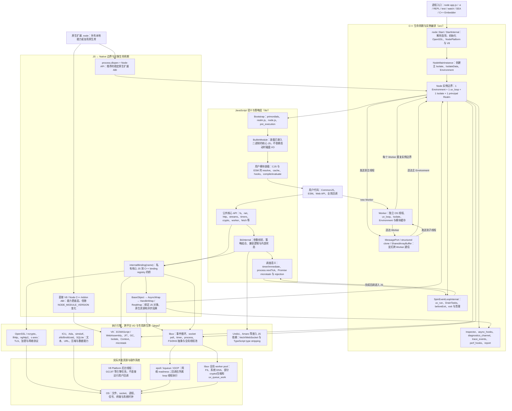
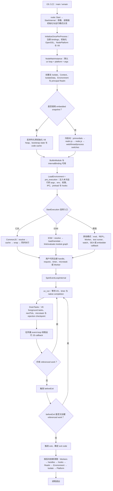
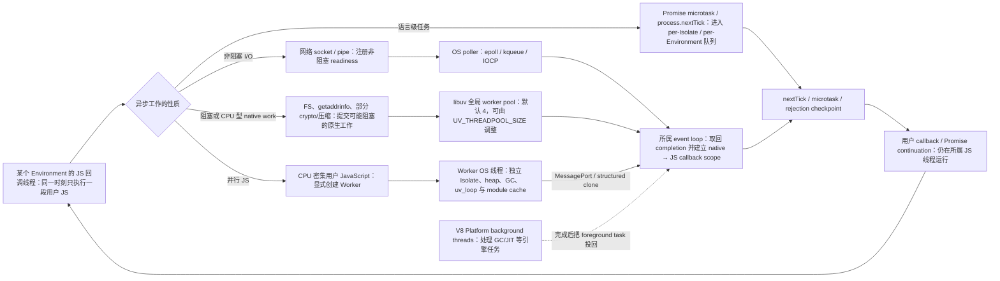
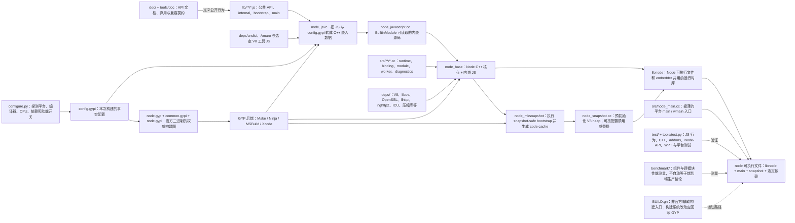

# Node.js Core 全景架构与核心思想

> **分析基线**：`main` @ `7a11a9b2db0983fa65b52e91fd21814f1ed3c207`，源码版本 `v27.0.0-pre`，2026-07-15。当前仓库没有根级 `package.json`，也没有 `out/` 构建产物；因此本文描述的是该提交的**源码架构**，不是某个已安装或已运行二进制的动态观测结果。

> **在线版本**：[在 Lark 中阅读（含 4 张可缩放架构白板）](https://mayfairtech.larkenterprise.com/docx/TwXbd2wPnojRyoxHL7uc0um3nMe)

## 1. 一句话结论

Node.js 不是“V8 加几个 API”，也不是“一条线程处理所有工作”。它是一个**运行时编排器**：V8 负责 JavaScript 与 WebAssembly 的执行、JIT、GC 和 microtask；libuv 负责跨平台事件循环、非阻塞 I/O 与工作线程池；Node C++ 核心负责进程、VM、线程、原生资源和生命周期；内嵌 JavaScript 负责公共 API、模块系统、兼容策略与调度语义。

从第一性原理看，V8 只有语言引擎而没有 `fs`、socket、进程和 Node 模块语义，libuv 只有 C 层异步机制而没有 JavaScript 对象模型；Node.js 的不可替代价值，是把两者连成一个有稳定 API、可诊断、可扩展、可跨平台发布的完整宿主环境。

本文把项目分成五个相互咬合的部分：

1. **构建期组装**：Python/GYP 把 C++、内建 JS、依赖库和启动快照装配成 `node`。
2. **实例与生命周期**：`Environment` 把一个事件循环、一个 V8 Isolate 和一个 principal Realm 绑定成 Node 实例。
3. **JS 策略层与 native 机制层**：公共 JS API 和 `lib/internal` 通过 `internalBinding()` 调用 C++ binding。
4. **异步与并发**：网络 readiness、libuv 全局线程池、Worker 独立 Isolate、V8 后台线程各有不同职责。
5. **兼容与保障**：公共 JS、Node-API、直接 C++ addon、Embedder API 和 core-private API 有不同稳定性边界，测试、基准和文档分别证明不同性质的结论。

## 2. 运行时总架构图

下图的阅读方向是“用户语义 → Node 内核 → 引擎/依赖 → OS”。它也把主 JS 线程、libuv 线程池、Worker 和 V8 后台线程明确分开。

可独立复用的图源位于 [`runtime-architecture.mmd`](runtime-architecture.mmd)。

## 3. 最重要的所有权模型

理解 Node.js 源码最有效的方法，不是先记几百个文件，而是先区分以下对象各自拥有的状态。

| 边界 | 它是什么 | 主要用途与所有权 |
| --- | --- | --- |
| Process | 一个宿主进程 | 持有一次性初始化的 V8 Platform、全局选项、信号/stdio、OpenSSL 状态和内建 binding 注册表。 |
| `MultiIsolatePlatform` | Node 对 `v8::Platform` 的实现 | 为多个 Isolate 调度 V8 foreground/background 工作；Worker 能共享进程级 Platform。 |
| OS thread | 实际执行线程 | 主线程和每个 Worker 都有线程亲和的事件循环；同一个 V8 Isolate 不能被任意线程无锁并发进入。 |
| `v8::Isolate` | 一台独立 JS VM | 拥有 JS heap、GC 和引擎状态。主线程与每个 Worker 各自有一个，彼此的普通 JS 对象不能直接互相引用。 |
| `IsolateData` | Node 的 per-Isolate 数据 | 保存快速字符串表、builtin loader、Platform/loop 关联和若干模板；Embedder 可在同一 Isolate 的合法范围内复用它。 |
| `v8::Context` | 一个 global 与一套 intrinsic | `vm.Context` 可在同一 Isolate 中创建多个 Context；Context 不等于完整 Node 实例。 |
| `Realm` | Node 对 ECMAScript realm 的包装 | 保存 per-realm builtin/binding 状态、cleanup hooks 和 `BaseObject` 列表。principal Realm 对应 Environment 的主 Context；当前普通 `vm.Context` 不创建 Node Realm。 |
| `Environment` | 一个 Node.js 实例 | 关联**一个** `uv_loop_t`、**一个** Isolate 和**一个** principal Realm，并保存 timer、async hooks、inspector、process 与退出状态。 |
| `BaseObject` | JS 对象与 C++ 对象的桥 | 把 V8 object 的 internal field 指向 C++ 实例，并协调 JS GC 与 native 生命周期。 |
| `AsyncWrap` / `HandleWrap` / `ReqWrap` | 异步资源包装层 | 增加 async id/trigger id、native→JS callback scope、libuv handle/request 的 ref、close 和清理语义。 |

这套分层解决的是一个基本矛盾：V8 的对象生命由 GC 决定，而 socket、文件请求、timer 等原生资源的生命由 OS 与 libuv 决定。如果只依赖 GC，活跃 socket 可能被过早回收；如果只依赖 native 引用，JS 对象又会泄漏。`BaseObject` 及其子类把两种生命周期显式对齐。

源码锚点：[`src/README.md`](../src/README.md#L278-L408) 定义 Context、event loop、Environment、Realm、IsolateData 和 Platform；[`src/README.md`](../src/README.md#L917-L1078) 定义 BaseObject/AsyncWrap/HandleWrap/ReqWrap。

## 4. 从进程启动到退出

可独立复用的图源位于 [`startup-sequence.mmd`](startup-sequence.mmd)。

### 4.1 Native 入口很薄，真正入口在 `StartInternal`

Unix `main()` 最终只调用 `node::Start(argc, argv)`；Windows 先把宽字符参数转为 UTF-8，再汇合到同一入口。`StartInternal()` 完成 argv 设置、一次性进程初始化、SEA/snapshot 分支，并用 `uv_default_loop()`、NodePlatform 和参数构造 `NodeMainInstance`。这条链可从 [`src/node_main.cc`](../src/node_main.cc#L34-L98)、[`src/node.cc`](../src/node.cc#L1564-L1639) 和 [`src/node_main_instance.cc`](../src/node_main_instance.cc#L33-L110) 连续跟踪。

### 4.2 Bootstrap 有“快照恢复”和“冷启动执行”两条路径

默认非交叉编译构建会生成 Node snapshot。构建期的 `node_mksnapshot` 预先执行只依赖确定性环境的 bootstrap，并保存初始化后的 V8 heap 与 code cache；运行时通常反序列化这些状态，而不是每次都完整重跑 `realm.js`/`node.js`。`--no-node-snapshot` 或特殊构建才走冷启动执行。

冷启动顺序大致是：

1. per-context `primordials`、DOMException、MessagePort 基础对象；
2. `internal/bootstrap/realm.js` 建立 binding loader 与 `BuiltinModule`；
3. `internal/bootstrap/node.js` 建立 `process`、global、Buffer、timer/task hooks；
4. Web globals 与 main/worker、是否拥有 process state 的 switches；
5. `pre_execution.js` 读取本次 argv、env、权限、IPC、preload 和 loader 配置；
6. `internal/main/*` 根据 CLI 模式进入文件、eval、REPL、test、watch 或 Worker 主程序。

这种拆分不是纯性能技巧。快照内容必须与构建机的 argv/env 无关；否则构建时状态会被“冻进”每个发行二进制。源码在 [`lib/internal/bootstrap/node.js`](../lib/internal/bootstrap/node.js#L7-L48) 直接记录了该约束，C++ 分派在 [`src/node_realm.cc`](../src/node_realm.cc#L195-L208) 和 [`src/node_realm.cc`](../src/node_realm.cc#L331-L372)。

### 4.3 普通主模块和 event loop 的先后关系

普通 CJS 主模块会在 `SpinEventLoopInternal()` 之前同步执行；ESM 路径会建立模块图并登记入口 Promise，再由 V8 microtask 与事件循环推进。`StartExecution()` 先根据 worker、inspect、eval、test、watch、文件入口、REPL 等模式选择 `internal/main/*`，普通文件才进入 `run_main_module.js`。入口选择见 [`src/node.cc`](../src/node.cc#L288-L405)，CJS/ESM 分派见 [`lib/internal/modules/run_main.js`](../lib/internal/modules/run_main.js#L47-L164)。

### 4.4 Event loop 不只是一次 `uv_run()`

主循环会反复：

1. 调用 `uv_run(UV_RUN_DEFAULT)` 处理 libuv timer、poll、request completion 和 handle callback；
2. 让 NodePlatform drain 当前 Isolate 的 V8 foreground tasks；
3. 检查 loop 是否仍有 referenced handle/request；
4. loop 空时触发 `beforeExit`；若监听器新建 referenced work，则重新进入 loop；
5. 真正空闲后触发 `exit`，再按依赖反序清理 Environment、Worker、Realm、IsolateData、Isolate 与进程级 Platform。

实际实现只有几十行，位于 [`src/api/embed_helpers.cc`](../src/api/embed_helpers.cc#L23-L77)。它解释了为什么“libuv event loop”等同于整个 Node 调度器是不准确的：Node 还必须在 libuv、V8 foreground tasks、microtask、`process.nextTick()` 和退出事件之间建立交汇点。

## 5. 异步与并发模型

可独立复用的图源位于 [`async-concurrency.mmd`](async-concurrency.mmd)。

### 5.1 四种“后台工作”不能混为一谈

| 机制 | 是否执行用户 JS | 是否有独立 JS heap | 典型工作 | 完成如何回到用户代码 |
| --- | --- | --- | --- | --- |
| OS 网络 poller | 否 | 否 | socket readable/writable、连接、pipe | readiness 回到所属 `uv_loop_t`，再在该线程运行 JS callback。 |
| libuv 全局 worker pool | 否 | 否 | 文件系统、`getaddrinfo/getnameinfo`、`uv_queue_work`，以及 Node 提交的部分 crypto/压缩任务 | native completion 被投递回提交请求的 loop，再进入 JS callback scope。 |
| `worker_threads` Worker | 是 | 是 | CPU 密集 JS、独立模块图和事件循环 | 通过 MessagePort、structured clone、transfer 或显式共享内存通信。 |
| V8 Platform background threads | 通常否 | 属于引擎内部 | GC、JIT 和其他 VM 后台任务 | 需要进入 JS 的 foreground task 回投到该 Isolate 所属 loop。 |

libuv worker pool 是**进程全局共享**的，不是每个 Worker 各有四条线程；默认大小为 4，可在启动时通过 `UV_THREADPOOL_SIZE` 调整。增加它可能提高特定阻塞 native workload 的吞吐，但也增加内存和调度竞争，不会让 CPU 密集用户 JS 自动并行。证据见 [`deps/uv/docs/src/threadpool.rst`](../deps/uv/docs/src/threadpool.rst#L7-L30)。

### 5.2 网络 I/O 与文件 I/O 的关键差异

网络 socket 可由 epoll/kqueue/IOCP 等机制报告 readiness，因此网络 I/O 通常不需要占用一个 worker 等待；跨平台文件系统接口缺少统一、可靠的同类机制，libuv 因而把异步文件操作放到线程池。vendored libuv 设计文档直接说明网络 I/O 在每个 loop 的线程上通过 poller 处理，而文件 I/O 使用全局线程池：[`deps/uv/docs/src/design.rst`](../deps/uv/docs/src/design.rst#L65-L78)、[`deps/uv/docs/src/design.rst`](../deps/uv/docs/src/design.rst#L139-L162)。

### 5.3 `fs.readFile()` 的完整因果链

以 `fs.readFile()` 为例：

1. 公共 API 在 [`lib/fs.js`](../lib/fs.js#L387-L410) 校验参数、处理 AbortSignal/VFS hook，并建立 `ReadFileContext`。
2. `lib/fs.js` 从 `internalBinding('fs')` 获取 `FSReqCallback` 和 native 方法；`internalBinding()` 在当前 Realm 缓存导出。
3. C++ `fs` binding 由 [`src/node_file.cc`](../src/node_file.cc#L4341-L4343) 注册；异步分支创建 `ReqWrap` 并调用 `uv_fs_*`。
4. libuv 在线程池完成阻塞文件调用，把 completion 投回原来的 loop。
5. `AsyncWrap::MakeCallback()` 恢复 async id/trigger id 和 AsyncLocalStorage 上下文，调用 JS completion。
6. 最外层 native→JS callback 返回时，Node 执行 Promise microtask、`process.nextTick()` 和 rejection 检查。

这条链说明“异步 API 在线程池执行 JavaScript callback”是错误模型：线程池只做 native 工作，用户 callback 仍回到拥有该 Environment 的 JS 线程。

## 6. 三套模块加载器与两类 native 扩展边界

Node.js 不是只有一个 `require()` loader，而是至少有三套职责不同的装载平面。

| 装载平面 | 载荷 | 为什么独立 | 稳定性 |
| --- | --- | --- | --- |
| `BuiltinModule` | `lib/**/*.js` 与选定的内嵌依赖 JS | 内核必须在文件系统 API、用户 hooks 和用户模块出现之前可信启动，且避免启动时磁盘依赖。 | public builtins 受 API 契约约束；`lib/internal` 不保证稳定。 |
| CJS loader | 用户 `.cjs`/CommonJS、JSON、`.node` 等 | 保留同步 `require()`、`require.cache`、扩展搜索和历史 monkey patch 兼容。 | 公开行为高度兼容；内部实现可演进。 |
| ESM loader | URL 化的 ESM/WasM/TS 等模块图 | 需要 resolve/load/translate、link/evaluate、TLA 与同步/异步 customization hooks。 | 公开 API 按稳定等级；部分 hooks 仍可能演进。 |

`internal/bootstrap/realm.js` 先建立：

- `process.binding()`：遗留公开入口，只允许 allowlist，兼容性风险高；
- `process._linkedBinding()`：Embedder 静态链接额外 binding 的入口；
- `internalBinding()`：core-private 的 C++ binding loader；
- `BuiltinModule`：内嵌核心 JS 的最小模块系统。

`internalBinding()` 的 JS 缓存位于 [`lib/internal/bootstrap/realm.js`](../lib/internal/bootstrap/realm.js#L185-L208)，C++ 端在 [`src/node_binding.cc`](../src/node_binding.cc#L585-L663) 从内部注册表找到 module、创建 exports，并在当前 Realm/Context 初始化。

### 为什么 core JS 使用 `primordials`

用户可以修改 `Array.prototype`、`Promise` 等全局 intrinsic。若内核在处理安全、I/O 或错误路径时直接调用可被用户 monkey patch 的方法，用户代码就能改变内核运行语义。per-context bootstrap 因而提前保存安全引用和 `SafeMap`/`SafeSet` 等 primordials，内部模块通过闭包拿到它们。这是“宿主代码与 guest code 共享同一语言环境”所必需的防御边界，而不仅是风格约定。

## 7. 关键依赖及用途

当前源码快照中，Node 为 `27.0.0-pre`、V8 为 `14.6.202.34`、libuv 为 `1.52.1`、OpenSSL 为 `3.5.7`、npm 为 `11.18.0`、Undici 为 `8.7.0`。这些是仓库内容版本，不证明本机已安装或正在运行相同构建。

| 依赖或子系统 | 在 Node 架构中的用途 | 典型上层入口 |
| --- | --- | --- |
| V8 | ECMAScript/WebAssembly、JIT、GC、Isolate/Context、Promise microtask、Inspector 基础 | 几乎全部 JS；`vm`、`v8`、ESM ModuleWrap |
| libuv | loop、timer、TCP/UDP/pipe/TTY、process、signal、FS、系统 DNS、线程抽象和全局 pool | `net`、`dgram`、`fs`、`child_process`、`timers`、Worker thread primitive |
| OpenSSL + ncrypto | TLS、证书、随机数、hash/cipher/signature、Web Crypto 的 native 能力 | `tls`、`https`、`crypto`、`globalThis.crypto` |
| llhttp | HTTP/1 请求/响应解析 | `http` / `https` server 和 client |
| nghttp2 | HTTP/2 framing、session 与 stream | `http2` |
| c-ares | channel-based DNS query；与走系统 `getaddrinfo` 的 `dns.lookup()` 路径不同 | `dns.resolve*()` |
| Undici | Fetch、Request/Response/Headers、WebSocket/EventSource 等 WHATWG 网络 API | `fetch` 与相关 global，按需加载 |
| ICU + simdutf | Intl、Unicode、编码和高效 UTF 转换 | `Intl`、`TextEncoder`/`TextDecoder`、字符串/Buffer 边界 |
| Ada | WHATWG URL 解析 | `URL`、`url` binding |
| zlib / Brotli / zstd | 同步与异步压缩；异步路径可使用线程池 | `zlib`、HTTP content encoding |
| Amaro | TypeScript type stripping/transformation | `--strip-types` 与 TS 模块路径 |
| SQLite | 内建 SQLite 能力，是否开放受版本/实验开关约束 | `node:sqlite` |
| npm / Corepack | 随发行包交付的包管理工具，不是 Node 主进程启动链的核心库 | 安装后的 `npm`/Corepack 命令 |
| postject / LIEF | Single Executable Application 的资源注入/编辑能力 | SEA 构建路径 |
| googletest | C++ 测试依赖，不属于生产运行时主路径 | `test/cctest` |

`deps/` 很大，但不能由“位于 deps”推导出“全部链接并在每次运行中初始化”。有些依赖被静态链接，有些 JS 被 `js2c` 嵌入，有些只用于构建、测试或随发行包交付；部分原生库还可以由下游构建 externalize。

### 7.1 公共核心子系统如何跨层实现

| 子系统 | JS 层主要负责 | Native/依赖层主要负责 | 关键运行特征 |
| --- | --- | --- | --- |
| timers / immediate | timer 列表、优先级、重复调度和回调语义 | 每个 Environment 的少量 `uv_timer_t`/check handle | 不是每个 timer 一条线程；JS 用最近到期时间重设 native timer。 |
| streams | readable/writable 状态机、pipe、Transform、`highWaterMark` 与 `drain` 背压 | socket/file/crypto/zlib 等具体 source/sink | 背压限制速率差转化为的内存增长，但不会把阻塞计算自动搬离 loop。 |
| net / dgram / pipe | Socket/Server API、连接状态、错误和事件语义 | TCP/UDP/PipeWrap、libuv handle 和 OS poller | 通常走 readiness polling，不为每个连接占一个线程。 |
| HTTP/1 | request/response、Agent、socket 生命周期与 header 语义 | llhttp 同步解析收到的 Buffer | parser 与部分 JS 协议逻辑仍运行在 loop 线程，大包/重回调会占用 loop。 |
| HTTP/2 | JS session/stream API 与 socket 接管 | nghttp2 frame、HPACK、session 状态机 | 多路复用不等于多个 JS 线程。 |
| Fetch / WebSocket | WHATWG API 与客户端策略 | 内嵌 Undici JS，最终复用 Node 网络/TLS 能力 | 与传统 `node:http` 是不同的上层客户端栈，并按需加载。 |
| DNS | `dns` API、参数/结果语义 | `dns.lookup()` 使用系统 getaddrinfo/thread pool；`dns.resolve*()` 使用 c-ares socket/loop | 两类 API 共享“DNS”名称，却具有不同调度和缓存/解析语义。 |
| TLS / crypto | JS API、Key/Object、Web Crypto promise 语义 | OpenSSL/ncrypto；部分 async CryptoJob 进入 pool | TLS stream 上的部分计算仍在 loop 线程；只有显式异步 job 才离开。 |
| diagnostics | channel/hook API、上下文和用户观察面 | AsyncWrap、trace events、V8 Inspector、性能里程碑 | `diagnostics_channel.publish()` 本身是同步通知；观测代码也可能影响被观测路径。 |

这进一步解释了“JS 策略、native 机制”的边界不是按模块机械切半：streams 大多是 JS 状态机，网络 handle 和文件 syscall 必须 native，HTTP/TLS 则跨 JS、C++ 和专用库共同完成。

## 8. 构建期架构

可独立复用的图源位于 [`build-architecture.mmd`](build-architecture.mmd)。

### 8.1 权威构建链

标准链路是：

`./configure` → `configure.py` → `config.gypi/config.mk` → GYP → Make/Ninja/MSBuild → `node.gyp` target graph → `node`

`node.gyp` 定义的核心 target 关系是 `node executable → libnode → node_base`。`node` target 本身只有很薄的 `src/node_main.cc`，大部分源码进入 `node_base`/`libnode`。[`BUILD.gn`](../BUILD.gn#L1-L13) 明确说明 GN 不是官方二进制的构建系统；只修改 GN 即使本地成功，也不能证明官方发布路径包含变更。

### 8.2 为什么把 JS 编进 C++ 二进制

`configure.py` 枚举 `lib/**/*.js`，`node_js2c` 再把这些文件、选定依赖 JS 和 `config.gypi` 生成 `node_javascript.cc`。因此核心模块：

- 不依赖安装目录里的散落 JS 文件；
- 在 `fs` 和用户模块 loader 尚未可用时就能启动；
- 与 native binary 和构建配置保持原子版本；
- 可进一步生成 startup snapshot/code cache，减少每次进程启动的初始化成本。

代价是修改 `lib/` 后默认需要重新生成/链接。开发模式 `--node-builtin-modules-path` 可从磁盘读取 builtins，以换取快速迭代，但它会关闭 Node snapshot/code cache，不能代表正式自包含二进制的启动路径。

关键 build action 位于 [`node.gyp`](../node.gyp#L1073-L1105)，snapshot action 位于 [`node.gyp`](../node.gyp#L1146-L1196)。

## 9. 仓库目录地图

| 路径 | 责任 | 阅读建议 |
| --- | --- | --- |
| `src/` | C++ runtime、binding、V8/libuv glue、Worker、Inspector、Node-API/Embedder public headers | 从 `node_main.cc`、`node.cc`、`node_main_instance.cc`、`api/environment.cc` 开始，不要按文件名全量扫。 |
| `lib/` | 公共 JS core API、`lib/internal`、bootstrap、main modes、CJS/ESM loader | 用一个 API 做纵向追踪，例如 `fs.js → internalBinding('fs') → node_file.cc`。 |
| `deps/` | vendored JS/native 依赖、构建/测试依赖和随发行包交付工具 | 先看 `node.gyp/node.gypi/configure.py` 是否真的把它接入目标路径。 |
| `tools/` | GYP、js2c、snapshot、test runner、lint、doc、依赖更新和 release 工具 | 构建/生成问题优先从对应 tool 和 `node.gyp` action 双向查。 |
| `test/` | JS 行为、C++、addon、Node-API、WPT、message、TTY、sequential/parallel、已知问题和负载测试 | `test/README.md` 解释每类测试能证明什么。 |
| `benchmark/` | 按子系统组织的 benchmark、compare runner 与统计/可视化工具 | 结果只支持实际执行的路径；组件基准不能外推生产端到端结论。 |
| `doc/api/` | 公共 API、稳定等级、弃用和兼容契约的源码 | 修改公开行为时，代码、测试和 API 文档必须一致。 |
| `doc/contributing/` | 构建、测试、发布、维护依赖等项目工作流 | 判断“官方路径”与“辅助路径”的主要依据。 |
| `typings/` + `tsconfig.json` | core 内部静态类型辅助，`noEmit` | 不是用户侧 `@types/node`，也不是 runtime 构建产物。 |
| `.github/` | CI、CODEOWNERS、automation 与仓库协作配置 | CI 证明的仍是相应 job/平台实际覆盖范围。 |

根级没有 `package.json` 是一个重要分类信号：尽管 `deps/npm`、`deps/undici` 等子树各有 package metadata，Node core 的顶层构建不是 npm scripts 驱动的应用工程。

## 10. 核心设计思想：因果与反事实

| 设计 | 为什么存在 | 如果反过来设计会怎样 |
| --- | --- | --- |
| Node 做编排，V8/libuv 各司其职 | 语言执行、OS 异步和宿主 API 是三类独立问题；组合比重写引擎或每个平台各写 runtime 更可维护。 | 只有 V8 没有 I/O/进程/模块；只有 libuv 没有 JS；每个平台直接写 I/O 会让语义和 bug 修复分裂。 |
| JS 负责策略，C++ 负责机制 | 模块、stream、兼容与校验逻辑需要快速、安全演进；引擎/OS 边界、资源句柄和热路径必须 native。 | 全部 C++ 会让 API 迭代成本高；全部 JS 又无法可靠访问 V8 与 OS 原语。 |
| 每个 Isolate 单线程进入，parallelism 显式化 | JS heap 无需普遍共享锁，callback 保持 run-to-completion；并行需求交给独立 Worker 和消息/共享内存协议。 | 多线程同时进入同一 heap 会引入数据竞争、锁开销和不可预测 GC；完全不提供 Worker 又无法利用多核跑 CPU 密集 JS。 |
| 一个 Environment 绑定一个 loop/Isolate/principal Realm | 把 Node 实例状态、VM 状态和 I/O 生命周期形成可清理边界，也支持 Worker 与 Embedder 多实例。 | 全局单例承载全部状态会让 Worker 隔离、独立退出、资源追踪与嵌入场景失效。 |
| Builtin/CJS/ESM loader 分离 | 内核要在 `fs` 和用户 hooks 之前启动；CJS 与 ESM 又具有不同解析、缓存和求值语义。 | 用 CJS loader 启动自身会出现 loader/`fs` 循环依赖；强行统一 CJS/ESM 会破坏同步 `require()` 或 TLA/hooks。 |
| 内嵌 JS + startup snapshot | 二进制自包含、构建配置与 core JS 原子一致，并把确定性初始化移出每次启动。 | 从磁盘加载会增加部署路径、I/O、篡改和版本错配问题；每次完整 bootstrap 会增加启动成本。 |
| primordials 隔离内核 | core 与用户共享一台 JS VM，必须防止用户 monkey patch 改写内核依赖的 intrinsic。 | 内部校验、容器和错误路径会被用户修改，出现安全与正确性问题。 |
| BaseObject/AsyncWrap 显式协调生命周期与因果 | JS GC、OS handle、native request 和 AsyncLocalStorage 的生命规则不同。 | 仅靠 GC 会过早释放 native 资源；仅靠 native 引用会泄漏；不记录 trigger id 会丢失异步上下文。 |
| 分阶段清理 | Worker、handle、Realm、Environment、Isolate 与 Platform 有严格反向依赖。 | 先销毁 Isolate 再关闭 handle，迟到 completion 会触发 use-after-free；省略 drain/cleanup 会泄漏资源。 |
| 稳定层与内部层分离 | 公共生态需要兼容，core 内部又必须持续重构；Node-API 还要隔离 V8 ABI 变化。 | 所有内部都承诺兼容会冻结实现；完全不设稳定层会迫使每个 native addon 随 Node major 重编译。 |

## 11. 兼容与扩展面

| 扩展面 | 能力 | 兼容边界 |
| --- | --- | --- |
| 公共 JS API | `node:fs`、`node:http`、Web globals 等 | 以 `doc/api` 稳定等级、弃用政策和 SemVer 为契约；Experimental 需要单独审计。 |
| CJS/ESM customization hooks | 自定义 resolve/load 与模块策略 | 同步和异步 hooks 的稳定等级可能不同；还要考虑 loader worker 与主线程边界。 |
| Node-API | 用 C ABI 构建 `.node` addon | 推荐；设计目标是跨 Node major 的 ABI 稳定，当前源码支持 Node-API 1..10。混用 V8/Node C++ API 会削弱保证。 |
| 直接 V8/Node C++ addon | 访问底层 V8、libuv、Node C++ interface | 受 `NODE_MODULE_VERSION` 约束，当前为 147；不匹配时 `process.dlopen` 会拒绝加载。 |
| C++ Embedder API | 在其他 C++ 应用中创建 Node Environment | 能力强，但允许在 semver-major 中发生无预警 breaking change。 |
| linked JS/native modules | 构建时把额外 JS 或 binding 静态链接进宿主 | 属于定制构建/嵌入边界，不是一般 npm package 兼容面。 |
| `lib/internal` / `internalBinding` | core 维护和调试 | 不向用户承诺兼容；`--expose-internals` 也仅供维护调试。 |

Node-API 的设计价值可以用反事实说明：直接 addon 的符号和对象布局依赖 V8/Node C++ ABI，V8 升级可能迫使 addon 重编译；Node-API 用不透明句柄和 C 函数表把 addon 与具体 JS 引擎隔开。源码说明见 [`doc/api/n-api.md`](../doc/api/n-api.md#L7-L20)，直接 addon 的 ABI 检查见 [`src/node_binding.cc`](../src/node_binding.cc#L515-L560)。

## 12. 测试、基准、文档与发布各证明什么

| 证据类型 | 主要入口 | 能证明 | 不能自动证明 |
| --- | --- | --- | --- |
| 组件/行为测试 | `tools/test.py`，`test/parallel`、`sequential`、`cctest`、addons、Node-API、WPT 等 | 指定代码路径和平台组合的功能/回归行为 | 所有平台、长时运行、生产负载和完整发布包行为 |
| 负载/压力测试 | `test/pummel` 等 | 特定场景在更大压力下的正确性 | 通用性能 SLO 或内存稳态 |
| Benchmark | `benchmark/run.js`、`compare.js` | 实际 benchmark 路径的吞吐/延迟差异 | 未执行的 end-to-end 路径、soak 或 production 收益 |
| API 文档测试 | `doc/api` + doc tools | 文档结构、链接和部分示例/契约一致性 | 实现行为本身完全正确 |
| CI | `.github/workflows` 与外部 Jenkins | 相应 job 覆盖的平台、配置与测试集合 | 未覆盖的 external/shared deps、发行环境或长期稳态 |
| Release tooling | Make targets、`tools/release.sh` 与外部发布基础设施 | 产物生成、校验和、签名和提升步骤 | 仅靠仓库本地脚本不能证明外部 Jenkins/nodejs.org 发布全链成功 |

`test/README.md` 把测试按用途分类，例如 `parallel`、`sequential`、`cctest`、addons、Node-API、internet、pummel 和 known issues；`benchmark/README.md` 则把性能测量单独组织。这种分离本身表达了项目理念：正确性证据和性能证据不可互相替代。

## 13. 推荐阅读路径

如果目标是快速建立可调试的心智模型，建议按因果链而不是目录字母序阅读：

1. **进程入口**：`src/node_main.cc` → `src/node.cc::StartInternal()`。
2. **实例创建**：`src/node_main_instance.cc` → `src/api/environment.cc` → `src/env.cc`。
3. **bootstrap**：`lib/internal/bootstrap/realm.js` → `node.js` → `internal/process/pre_execution.js`。
4. **主模块**：`lib/internal/main/run_main_module.js` → `internal/modules/run_main.js` → CJS/ESM loader。
5. **一个纵向 API**：`lib/fs.js` → `internalBinding('fs')` → `src/node_binding.cc` → `src/node_file.cc` → libuv。
6. **loop 与 callback**：`src/api/embed_helpers.cc`、`src/api/callback.cc`、`lib/internal/process/task_queues.js`。
7. **并行**：`lib/internal/worker.js` → `src/node_worker.cc` → MessagePort 实现。
8. **构建逆向**：`configure.py` → `node.gyp` → `tools/js2c.cc` → `tools/snapshot/`。
9. **契约与验证**：对应 `doc/api`、`test`、`benchmark` 和 CI job。

## 14. 关键源码证据索引

| 结论 | 当前提交中的证据 |
| --- | --- |
| Native main 只汇入 `node::Start` | `src/node_main.cc:34-98` |
| `StartInternal` 完成进程初始化、snapshot 与主实例创建 | `src/node.cc:1564-1639` |
| 主实例创建 Environment、加载 JS 并进入 loop | `src/node_main_instance.cc:33-110` |
| Environment = loop + Isolate + principal Realm | `src/README.md:307-336` |
| 冷启动 bootstrap 顺序 | `src/node_realm.cc:195-208,331-372` |
| 内建 JS、binding loader 与用户 loader 的区分 | `lib/internal/bootstrap/realm.js:1-39,185-238` |
| `StartExecution` 的 CLI 模式分派 | `src/node.cc:288-405` |
| CJS/ESM 主入口选择 | `lib/internal/modules/run_main.js:47-164` |
| event loop、V8 task 与 `beforeExit` 的交汇 | `src/api/embed_helpers.cc:23-77` |
| nextTick/microtask/rejection 队列 | `lib/internal/process/task_queues.js:49-109`、`src/node_task_queue.cc:129-194` |
| Worker 独立 loop/Isolate/Environment/OS thread | `src/node_worker.cc:159-220,296-435,727-773` |
| libuv 全局线程池与回投 loop 语义 | `deps/uv/docs/src/threadpool.rst:7-49` |
| 内建 JS 生成与嵌入 | `node.gyp:1073-1105` |
| snapshot 生成并进入 libnode | `node.gyp:1146-1196,1727-1813` |
| GN 不是官方发布构建图 | `BUILD.gn:1-13` |
| Node-API 的 ABI 稳定目标 | `doc/api/n-api.md:7-20` |
| 直接 addon 的 ABI 版本拒绝逻辑 | `src/node_binding.cc:515-560` |

## 15. 证据边界

本文已做到：

- 以当前 HEAD 的源码和仓库文档交叉验证构建、启动、module、binding、async、Worker、cleanup 与兼容边界；
- 将 build-time、runtime、线程/Isolate、public/internal 和 component/end-to-end 证据范围分开；
- 提供可维护 Mermaid 图源，而不是不可追踪的静态截图。

本文没有声称：

- 当前 HEAD 已在本机成功编译、安装或激活；仓库中没有 `out/` 产物；
- 某个具体 Node 应用的生产吞吐、延迟、内存或 soak 状态；
- 所有 `deps/` 在所有构建配置中都被静态链接或启用；
- 仅凭组件 benchmark 就能推出端到端或生产性能结论。

因此，本交付状态是**源码架构已取证并文档化**，不是 runtime/system/production verification。
