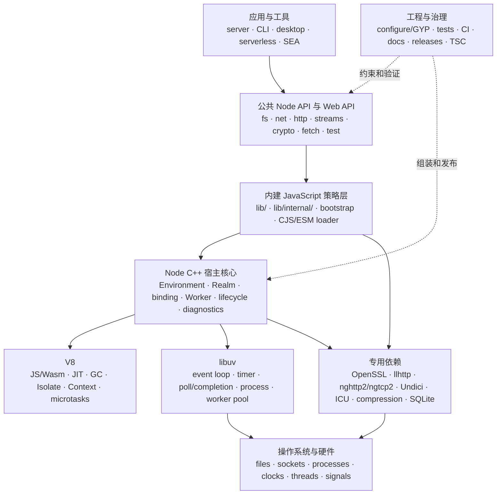
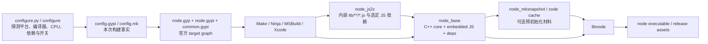

# Node.js 项目技术全景：关键架构、技术方案与演进约束

> **文档定位**：这是 Node.js Core 仓库的中文“总技术地图”。它回答四类问题：系统由什么组成、为什么这样分层、项目公开声明了哪些技术优先事项、一个高风险变更怎样从想法走到可发布证据。
>
> **分析基线**：文档分支 `docs/architecture` @ `8e4343aa38f3c2c8f4ce288cb179493a0731959d`；承载运行时代码的基线为其父提交 `main` @ `7a11a9b2db0983fa65b52e91fd21814f1ed3c207`；源码版本 `v27.0.0-pre`，`NODE_MODULE_VERSION=147`，Node-API `1..10`（默认 `8`），V8 `14.6.202.34`，libuv `1.52.1`。核对日期：2026-07-20。
>
> **证据状态**：当前 checkout 没有 `out/` 构建产物。本文是源码、构建图、测试说明、维护策略与发布流程的交叉取证，不声称当前 HEAD 已在本机编译、安装、运行或经过生产验证。
>
> **远端边界**：当前 `origin` 是 `noscripter/node` 个人 fork，而不是 `nodejs/node` 官方远端。本文分析的是其 Node.js Core 源码血缘与当前 checkout，不把 fork 的远端状态写成官方仓库、CI 或发布状态。

相关深潜材料：

- 如果你第一次接触 V8、Isolate、Realm、microtask、libuv 或 bootstrap，先读 [《Node.js Core 全景架构与核心思想》](nodejs-core-architecture.zh-CN.md)。那份文档负责“术语翻译成人话”和运行时源码深潜。
- 本文负责把运行时、公共子系统、工程体系、官方技术优先事项、安全、发布和技术方案门禁拼成一张更大的地图。
- 五张可单独维护的图源位于当前目录：[`beginner-mental-model.mmd`](beginner-mental-model.mmd)、[`runtime-architecture.mmd`](runtime-architecture.mmd)、[`startup-sequence.mmd`](startup-sequence.mmd)、[`async-concurrency.mmd`](async-concurrency.mmd)、[`build-architecture.mmd`](build-architecture.mmd)。

按角色选择阅读路线：

| 你是谁 | 建议路线 | 读完能回答什么 |
| --- | --- | --- |
| 第一天入组 | 第 1–4 章 → 第 17 章 → 运行时深潜文档 | V8、libuv、Isolate、microtask 和 Worker 各管什么 |
| 应用/库作者 | 第 5–8 章 → 第 11 章 | 模块、网络、内存、安全和兼容边界怎样影响应用 |
| Core 贡献者 | 第 2–11 章 → 第 16、18 章 | 一次改动该从哪里追源码、怎样构建、测试和发布 |
| 技术方案作者/Reviewer | 第 12–15 章 → 第 19 章 | 如何把方向变成有指标、回滚和证据的可发布计划 |

---

## 0. 先说清楚：“技术优先事项”不等于“已经排期的路线图”

仓库中的 [`doc/contributing/technical-priorities.md`](../doc/contributing/technical-priorities.md) 列出了项目认可的重要技术方向，但文件正文明确说明它来自 2021–2022 年的 Next-10 讨论，并由 TSC/Next-10 周期性复审。它是**方向性优先级快照**，不是包含负责人、里程碑和交付日期的 sprint backlog。

本文严格区分三种状态：

| 状态 | 它回答什么 | 可以用什么证据 | 不能偷换成什么 |
| --- | --- | --- | --- |
| **当前架构** | 当前源码怎样工作 | `src/`、`lib/`、`node.gyp`、当前 API 文档与测试 | “未来一定继续这样” |
| **项目方向** | 项目认为哪些问题重要 | `technical-priorities.md`、maintaining 策略、安全模型策略 | 已承诺日期、已完成状态 |
| **可发布方案** | 某个具体改动是否具备上线证据 | 原始 diff、测试、端到端时序、基准、兼容审计、回滚与产物清理证据 | 仅凭设计稿或组件 benchmark 宣布完成 |

一个好记的版本是：**方向是指南针，架构是现在所在的位置，技术方案才是下一段可执行路线。**拿指南针当已到站通知，会让项目管理像把 `Promise` 当线程一样喜感。

---

## 1. 一页结论

Node.js 不是“V8 外面套一层 `fs`”，而是一个跨平台宿主系统：

1. **V8** 负责 ECMAScript/WebAssembly、对象图、JIT、GC、Isolate、Context 与 microtask。
2. **libuv** 负责跨平台 event loop、网络 I/O 通知、timer、进程、信号、文件/DNS 抽象和全局 worker pool。
3. **Node C++ 核心** 负责进程初始化、Platform、Isolate、Environment、native binding、资源生命周期、callback scope、Worker、诊断与退出。
4. **内建 JavaScript** 负责公共 API、`lib/internal` 策略层、bootstrap、CJS/ESM loader、Web API、streams、test runner 等用户可见语义。
5. **vendored dependencies** 提供 V8、OpenSSL、llhttp、nghttp2、Undici、ICU、zlib、SQLite 等专门能力；它们进入最终产物的方式由配置和构建图决定。
6. **工程体系** 通过 GYP 构建图、跨平台 CI、测试分层、API 文档、SemVer、backport、签名发布与项目治理控制变化。

Node.js 最核心的架构思想不是某个类名，而是四条边界：

- **语言执行与宿主能力分离**：V8 不负责 `node:fs`，libuv 也不认识 JavaScript 对象。
- **实例与所有权显式化**：一个 `Environment` 绑定 loop、Isolate、principal Realm 与大量实例状态。
- **JS 策略与 native 机制分层**：JS 层快速演进语义，C++ 层管理 OS/V8 边界和资源句柄。
- **兼容承诺分级**：公共 JS API、Node-API、直接 C++ addon、Embedder API、`lib/internal` 的稳定性不是同一份合同。

---

## 2. 系统上下文与总架构

### 2.1 Node.js 处在什么位置



这张图有两个阅读方向：

- 从上往下看，是一次用户请求怎样下沉到语言引擎、native 机制和操作系统。
- 从右往左看，是工程流程怎样约束所有可发布变化。没有测试、文档、兼容和发布流程的 runtime，只是一台跑得很快但没有刹车说明书的实验车。

### 2.2 运行时的所有权骨架

| 对象/边界 | 主要职责 | 所有权与并发边界 | 关键证据 |
| --- | --- | --- | --- |
| `MultiIsolatePlatform` / V8 Platform | V8 foreground/background task、线程资源 | 进程级；多个 Isolate 可共用 Platform | [`src/node.cc`](../src/node.cc)、[`src/node_platform.cc`](../src/node_platform.cc) |
| `Isolate` | 一个 V8 VM、heap、GC 与普通 JS object graph | 通常只由所属 JS 线程进入；Worker 各有独立 Isolate | [`src/README.md`](../src/README.md)、[`src/node_worker.cc`](../src/node_worker.cc) |
| `Realm` | Context 上的 Node builtins、binding、cleanup 与对象登记 | per-realm；普通 `vm.Context` 不自动等于完整 Node Realm | [`src/node_realm.h`](../src/node_realm.h)、[`lib/internal/bootstrap/realm.js`](../lib/internal/bootstrap/realm.js) |
| `Environment` | 绑定 loop、Isolate、principal Realm、timer、hooks、inspector 与退出状态 | Node 实例边界；主线程和 Worker 各自拥有 | [`src/env.h`](../src/env.h)、[`src/api/environment.cc`](../src/api/environment.cc) |
| `BaseObject` / `AsyncWrap` | 连接 JS 对象、native 对象与异步因果 | 生命周期必须协调 GC、native close 与 async context | [`src/base_object.h`](../src/base_object.h)、[`src/async_wrap.h`](../src/async_wrap.h) |
| `uv_loop_t` | 管理 handle、request、timer、I/O completion | per Environment/Worker；不是整个 Node 调度器的同义词 | [`src/api/embed_helpers.cc`](../src/api/embed_helpers.cc)、[`deps/uv/docs/src/design.rst`](../deps/uv/docs/src/design.rst) |

反事实推演：如果所有状态都塞进进程级全局单例，Worker 隔离、Embedder 多实例、独立退出和资源清理都会互相踩脚；如果让任意线程直接进入同一个 Isolate，普通 JS object graph 就会暴露给不可预测的数据竞争和 GC 时序。

---

## 3. 从进程启动到退出

### 3.1 启动主链

```text
src/node_main.cc
  → node::Start()
  → StartInternal()
  → 初始化进程选项、OpenSSL、Node Platform 与 V8
  → 创建 NodeMainInstance
  → 创建主 Isolate / IsolateData / Environment
  → LoadEnvironment()
  → bootstrap 与入口模式分派
  → 执行 CJS / ESM / REPL / eval / test / watch / Worker / embedder 回调
  → SpinEventLoopInternal()
  → beforeExit / exit / 反向清理
```

关键文件：[`src/node_main.cc`](../src/node_main.cc)、[`src/node.cc`](../src/node.cc)、[`src/node_main_instance.cc`](../src/node_main_instance.cc)、[`src/api/environment.cc`](../src/api/environment.cc)、[`src/api/embed_helpers.cc`](../src/api/embed_helpers.cc)。

### 3.2 Bootstrap 为什么分层

Bootstrap 不是一坨“启动脚本”，而是按信任与生命周期分层：

1. `lib/internal/bootstrap/realm.js` 建立 primordials、binding loader 与 `BuiltinModule`。
2. `lib/internal/bootstrap/node.js` 建立 `process`、global、Buffer、timer/task hooks 等运行时骨架。
3. `internal/process/pre_execution.js` 读取本次进程的 argv、env、权限、IPC、preload、loader 与配置。
4. `lib/internal/main/*` 根据 CLI 模式进入用户程序。

构建时 startup snapshot 可以预执行**与本次运行环境无关**的部分；argv、env、IPC、权限路径等必须在恢复后重新接线。把构建机环境“冻进”发行二进制，会得到一份非常忠诚但忠诚对象搞错了的快照。

### 3.3 Event loop 不是一次 `uv_run()`

主循环要协调：

- libuv timer、poll、handle callback 与 request completion；
- 目标 Isolate 的 V8 foreground tasks；
- Node `process.nextTick()`、V8 microtasks 与 rejection checkpoint；
- referenced handle/request 的存活判断；
- `beforeExit` 可能新建工作后重新进入 loop；
- `exit` 与 Environment、Realm、Isolate、Platform 的反向清理。

所以，“libuv event loop = Node 全部调度器”是不完整模型；`SpinEventLoopInternal()` 才是宿主层把多个调度域接起来的交汇点。

---

## 4. 异步、并发与多线程方案

### 4.1 四种后台工作不能混叫“线程池”

| 机制 | 典型用途 | 是否运行用户 JS | 结果回到哪里 | 常见误区 |
| --- | --- | --- | --- | --- |
| OS I/O 通知 | socket readiness/completion | 否 | 提交操作的 loop/JS 线程 | “网络 callback 在线程池执行” |
| libuv 全局 worker pool | 文件、系统 DNS、部分 crypto/压缩、`uv_queue_work` | 只做 native work | 原 loop completion | “每个 Worker 有独立 libuv pool” |
| `worker_threads` | CPU 密集 JS、隔离并行任务 | 是，运行在独立 Isolate | MessagePort/共享内存显式通信 | “Worker 是更大的 Promise” |
| V8 background tasks | 部分并发 GC、编译等引擎工作 | 不直接运行普通用户 callback | 目标 Isolate 的安全边界 | “V8 后台线程可随便进入 JS” |

### 4.2 `fs.readFile()` 的纵向因果链

```text
用户调用 node:fs
  → lib/fs.js 校验参数并创建请求状态
  → internalBinding('fs')
  → src/node_file.cc 创建 ReqWrap / 调用 uv_fs_*
  → libuv worker pool 执行可能阻塞的文件系统调用
  → completion 回投原 uv_loop_t
  → AsyncWrap callback scope 恢复 async context
  → 所属 JS 线程运行 callback
  → 推进相应的 nextTick / microtask / rejection checkpoints
```

这条链解释了三个“为什么”：

- 为什么异步文件 I/O 不阻塞 JS 线程：阻塞工作被提交到 native pool。
- 为什么 callback 仍能安全访问原 JS 对象：它最终回到拥有该 Environment/Isolate 的线程。
- 为什么 AsyncLocalStorage 能跨异步边界：`AsyncWrap` 记录并恢复异步因果身份，而不是靠运气认亲。

### 4.3 多线程技术方向的真实约束

官方技术优先事项要求更好的多线程支持，但它不等于“把每个 API 自动丢给 Worker”。可行方案必须同时处理：

- Isolate 之间普通对象不可直接共享；
- structured clone 和 transfer 有序列化/所有权成本；
- `SharedArrayBuffer` 需要 Atomics 和明确数据协议；
- Worker 启动、模块加载、heap 与 loop 都有固定成本；
- 主 loop 上的健康检查、指标采集仍可能被长时间同步 JS 饿死；
- 线程数增加可能把 CPU、内存和调度开销一起放大。

---

## 5. 代码装载、模块与可执行分发

### 5.1 四条加载路径

| 路径 | 内容来源 | 核心阶段 | 缓存/信任边界 |
| --- | --- | --- | --- |
| Builtin loader | 构建期嵌入二进制的 core JS | `BuiltinModule` 取源码并编译 | core-private；启动时不依赖磁盘读取 `lib/` |
| CommonJS | 文件、JSON、`.node` addon | resolve → cache → wrapper → 同步执行 | `require.cache`；历史兼容面大 |
| ESM | URL/文件/自定义 hook | resolve → load/translate → link → evaluate | module graph；支持异步求值和 top-level await |
| Native addon | `.node` 动态库或 linked module | `process.dlopen()` / Node-API / C++ ABI | Node-API 与直接 V8/Node ABI 的稳定承诺不同 |

三个 loader 分开不是重复造轮子：Builtin 必须在文件 API 尚未可用时工作；CJS 保持同步 `require()` 与历史语义；ESM 必须遵循标准 module graph 和异步求值边界。

### 5.2 ESM、最新 ECMAScript 与 TypeScript

- 最新 ECMAScript 能力主要随 vendored V8 升级进入，但升级同时影响 bytecode/JIT、GC、Inspector、ABI 和快照，因此不能只跑语法测试。
- ESM 的关键实现位于 [`lib/internal/modules/esm/`](../lib/internal/modules/esm/)，CJS 位于 [`lib/internal/modules/cjs/`](../lib/internal/modules/cjs/)。自定义 hook 还要考虑 loader worker 与主线程之间的边界。
- 当前 [`doc/api/typescript.md`](../doc/api/typescript.md) 描述了稳定的 type stripping：Node 可执行只含可擦除类型语法的 TypeScript，但不等于内置完整 TypeScript 编译器、类型检查器或 `tsconfig.json` 实现。
- [`maintaining-types-for-nodejs.md`](../doc/contributing/maintaining/maintaining-types-for-nodejs.md) 记录的方向是让公共 API 文档产生机器可读数据，并由外部类型项目消费；`typings/` 也不能简单解释成“Node 已随 binary 交付全部公共 `.d.ts`”。

### 5.3 模块自定义 hook 与 compile cache

当前 checkout 同时存在两代模块自定义入口，它们不能只用一个“loader hook”概括：

| 入口 | 当前状态 | 在哪里执行 | 使用提醒 |
| --- | --- | --- | --- |
| `module.registerHooks()` | Stability 1.2，Release candidate | 在加载模块的线程与 Realm 中同步执行 | 当前优先方案；同时覆盖后续 `require()`/`import()` 更直观 |
| `module.register()` | Stability 0，runtime deprecated | 异步 hook 在专用 loader thread 中执行 | 有跨线程开销；Permission Model 下需要 `--allow-worker` |

同步 hook 按后注册先执行（LIFO）组成链；不调用 `nextResolve()`/`nextLoad()` 时，必须用 `shortCircuit: true` 明确表示“到我这里就截胡”。同一模块中的静态 `import` 会先于注册代码执行，所以若要覆盖入口模块及 Worker，通常应通过 `--import`/`--require` 预加载；否则就应在注册后使用 `require()` 或动态 `import()`。Hook 能改写解析结果、源码与格式，因此它是**可信扩展点**，不是安全策略。

Module compile cache 则是另一回事：它把 CJS、ESM 或 TypeScript 模块的 **V8 编译结果**持久化到磁盘，减少后续解析/编译工作；它不缓存 exports，也不会跳过模块求值和副作用。缓存通常只在同一 Node 版本内复用，磁盘布局是实现细节，退出/显式 flush 才会写入，并且旧 cache 需要失效与清理策略。它像把切好的菜放冰箱，不是把昨天整场晚宴连客人一起暂停保存。

证据：[`doc/api/module.md`](../doc/api/module.md)、[`lib/internal/modules/customization_hooks.js`](../lib/internal/modules/customization_hooks.js)、[`lib/internal/modules/esm/`](../lib/internal/modules/esm/)。

### 5.4 Startup snapshot、用户快照与 SEA 不是同一件事

| 机制 | 保存/嵌入什么 | 主要目标 | 关键限制 |
| --- | --- | --- | --- |
| Node startup snapshot | 预初始化 V8 object graph 与 Node metadata | 加速普通 Node 启动 | 只能序列化 snapshot-safe 状态 |
| 用户 startup snapshot | 应用初始化状态与 deserialize main | 缩短应用启动 | 构建/运行平台、资源重建和不可序列化对象受限 |
| SEA preparation blob | 主脚本、资源、可选 code cache/snapshot 等 | 把应用与 Node 组合成单可执行文件 | 平台/二进制格式、签名、addon、资源和模块语义均需审计 |
| Diagnostic heap snapshot | 当前 Isolate 的 heap 对象图 | 内存诊断 | 生成会阻塞 loop，并可能需要约两倍 heap 内存 |

当前 SEA 用户入口见 [`doc/api/single-executable-applications.md`](../doc/api/single-executable-applications.md) 与 [`src/node_sea.cc`](../src/node_sea.cc)。维护策略文件可能滞后于当前 API，因此具体能力必须以当前 API 文档、源码和测试为准，不能把旧的“upcoming”列表当今天的状态表。

---

## 6. Native binding、Addon 与 Embedder

### 6.1 Core-private binding

公共 JS API 常通过 `internalBinding(name)` 获取 C++ 能力。Binding 负责把参数转换、V8 对象、native 资源和错误语义接起来，但 `internalBinding()` 本身不对用户承诺兼容。

典型链路：

```text
lib/fs.js
  → internalBinding('fs')
  → binding registry
  → src/node_file.cc
  → libuv uv_fs_*
```

### 6.2 扩展面的稳定性阶梯

| 扩展面 | 适合谁 | 稳定边界 | 变更风险 |
| --- | --- | --- | --- |
| 公共 JS API | 普通应用/库作者 | API 文档、稳定等级、弃用政策与 SemVer | 行为、错误、性能、平台差异 |
| Node-API | 需要 native 能力的 addon | 稳定 C ABI、导出函数与不透明类型，目标是跨 Node major | 混用 V8/Node 私有 C++ API 会削弱保证 |
| 直接 V8/Node C++ addon | 需要底层控制的 addon | 受 `NODE_MODULE_VERSION` 和 C++ ABI 影响 | V8/Node 升级常需重编译甚至改源码 |
| C++ Embedder API | 把 Node 嵌入其他宿主 | 能力强，major 版本允许 breaking change | lifecycle、Platform、loop 与资源所有权复杂 |
| linked JS/native module | 定制发行版/宿主 | 构建期私有扩展边界 | 与官方发行配置、测试矩阵可能不同 |

Node-API 的关键不是“有一张神秘 C++ 万能表”，而是用稳定 C ABI 和不透明句柄隔离具体 V8 对象布局。证据见 [`doc/api/n-api.md`](../doc/api/n-api.md) 与 [`src/node_binding.cc`](../src/node_binding.cc)。

---

## 7. 公共能力子系统架构

### 7.1 网络、HTTP 与 Streams

网络栈不是一条单线，而是多层组合：

```text
应用语义
  → Fetch / HTTP / HTTPS / HTTP2 / QUIC 等公共 API
  → JS 状态机、headers、stream/backpressure、diagnostics
  → llhttp / nghttp2 / ngtcp2 / OpenSSL / Undici 等协议实现
  → net / tls / UDP / TCP / QUIC transport
  → libuv 与 OS I/O
```

关键边界：

- `net`/socket 是 transport；HTTP API 不应被某个 transport 的细节永久锁死。
- Streams 提供 backpressure、销毁、pipeline 与组合语义，是文件、HTTP、压缩等子系统之间的重要“通用管道”。忽略 backpressure，就像只扩建入口不扩建仓库，吞吐图会先笑，内存随后哭。
- `writable.write()` 返回 `false` 不是“写失败”，而是“内部队列到达调度阈值，请等 `drain` 再送”；生产者继续猛塞，输入输出速率差最终就会变成内存。
- `highWaterMark` 是阈值，不是硬内存上限；object mode 计算对象个数，也不会替你发现某个对象胖得像搬家纸箱。`pipeline()` 的价值则是统一错误、`close`、`destroy`、取消和多种 stream/iterable 的清理。
- 传统 `http`/`https`/`http2` 兼容面巨大。[`maintaining-http.md`](../doc/contributing/maintaining/maintaining-http.md) 记录的方向是协议/transport 无关、客户端与服务端更一致、同时提供高低层抽象；但它是战略记录，不是已完成声明。
- 高层 Fetch 客户端建立在 vendored Undici 之上；HTTP/1 parser 使用 llhttp，HTTP/2 使用 nghttp2，QUIC/HTTP3 还涉及 ngtcp2/nghttp3 与专门 native 代码。每个协议栈都有独立的稳定性与构建开关。

入口：[`lib/net.js`](../lib/net.js)、[`lib/http.js`](../lib/http.js)、[`lib/http2.js`](../lib/http2.js)、[`lib/internal/streams/`](../lib/internal/streams/)、[`src/quic/README.md`](../src/quic/README.md)。

### 7.2 TLS、Crypto 与信任材料

TLS/Crypto 跨越公共 JS、Node 的参数/对象层、OpenSSL/ncrypto 与 OS：

- `crypto`、`tls`、`https` 与 Web Crypto 共享一部分底层能力，但公共对象和兼容语义不同。
- OpenSSL/根证书升级既是功能变化，也是安全、兼容、性能和发行产物变化。
- FIPS、shared OpenSSL、平台证书、内置根证书等构建/运行模式必须分别验证，不能用默认静态构建代表全部配置。

维护入口：[`maintaining-openssl.md`](../doc/contributing/maintaining/maintaining-openssl.md)、[`maintaining-root-certs.md`](../doc/contributing/maintaining/maintaining-root-certs.md)、[`src/crypto/`](../src/crypto/)。

### 7.3 Web Platform 与 vendored JavaScript

Fetch、WebSocket、Web Streams、URL、TextEncoder 等能力让 Node 与浏览器生态靠近，但“API 名字相同”不保证宿主行为完全相同：

- Web API 仍受 Node event loop、Buffer、streams、AbortSignal、diagnostics 和权限模型影响。
- 一部分实现来自 vendored JS 依赖，例如 Undici；它们会通过 `js2c`/构建配置进入 binary，而不是在用户启动时从 npm registry 安装。
- WHATWG/WPT 测试帮助验证标准兼容，但不能替代 Node 特有资源、性能和退出语义的测试。

### 7.4 诊断与可观测性

| 能力 | 解决的问题 | 入口 | 使用边界 |
| --- | --- | --- | --- |
| Inspector | 交互式调试、CPU/heap profiling | [`doc/api/inspector.md`](../doc/api/inspector.md)、`src/inspector_agent.cc` | 开启方式、跨进程激活与权限需审计 |
| Diagnostic report | 崩溃/信号/按需状态报告 | [`doc/api/report.md`](../doc/api/report.md)、`src/node_report.cc` | 是诊断快照，不是持续 tracing |
| `perf_hooks` | event loop、资源与用户 timing | [`doc/api/perf_hooks.md`](../doc/api/perf_hooks.md)、`src/node_perf.cc` | 插桩本身有成本；指标不自动解释因果 |
| Trace events | 跨组件时间线事件 | [`doc/api/tracing.md`](../doc/api/tracing.md)、`src/node_trace_events.cc` | 类别与采样范围决定结论边界 |
| `diagnostics_channel` | 低耦合发布/订阅诊断事件 | [`doc/api/diagnostics_channel.md`](../doc/api/diagnostics_channel.md) | subscriber 同步执行，会直接增加被观测路径延迟 |
| Heap snapshot / V8 stats | 对象引用、heap 空间与 GC 线索 | [`doc/api/v8.md`](../doc/api/v8.md) | snapshot 可阻塞 loop，内存峰值可接近额外一份 heap |

项目把 observability 列为技术优先事项，因为生产问题不是“再跑一次单测”就会礼貌复现。正确目标是建立**可解释的信号链**：日志告诉发生了什么，metrics 告诉变化多大，trace 告诉时间花在哪，heap/report 告诉状态为何积累。

诊断能力也有隐私与扰动成本：diagnostic report 可包含环境变量和网络信息，生产方案应评估 `--report-exclude-env` 与 `--report-exclude-network`；heap snapshot 会阻塞所属 Isolate 的 loop，故障现场内存紧张时还可能把“调查事故”升级成“参与事故”。

### 7.5 内存与资源生命周期

Node process 的内存不等于 V8 heap：

```text
process memory
  = V8 heap / code / metadata
  + Buffer 与 ArrayBuffer backing stores
  + C/C++ 对象与 allocator
  + OpenSSL / ICU / SQLite / protocol libraries
  + 每条线程的 stack
  + mmap、共享库和其他 OS 映射
```

因此，`heapUsed` 下降而 RSS 不降不一定是泄漏；GC 也不会替你关闭 socket、停止 timer 或释放错误持有的 native handle。内存技术方案必须同时检查：JS reachability、external memory、native owner、handle/request 关闭、Worker 生命周期、allocator/OS 回收行为。

---

## 8. 安全模型与权限方案

### 8.1 先画边界：Node 默认信任它被要求执行的代码

[`security-model-strategy.md`](../doc/contributing/security-model-strategy.md) 与 [`SECURITY.md`](../SECURITY.md) 的核心边界是：

- Node.js 不把普通 JavaScript 或 native code 当作敌对代码；默认不是沙箱。
- API 能被应用错误使用，不自动等于 Node 漏洞。
- 真正的漏洞判断依赖 threat model、公开 API 合同、攻击者能力与安全边界。
- 第三方模块、实验平台、compile-time/V8 flag 特性、V8 sandbox 等有各自报告边界。

### 8.2 Permission Model 是安全带，不是防弹玻璃

当前 [`doc/api/permissions.md`](../doc/api/permissions.md) 将 Permission Model 标为 Stable，并可限制文件、网络、子进程、Worker、addon、WASI、FFI 和 Inspector 等能力。但文档同时明确：

- 它用于减少**受信任代码误操作**；
- 它不能安全执行恶意代码，恶意代码可能绕过限制；
- `process.permission.drop()` 只影响未来检查，不会替应用关闭已打开的 fd、socket、child process 或 Worker；
- Permission Model 不自动继承到 Worker，且 `--env-file`、`--openssl-config` 等 Environment 建立前的读取不受它约束；
- 通过 `node:fs` 使用既有文件描述符会绕过路径权限检查，授权路径中的相对符号链接也可能越界；
- `process._debugProcess()` 的跨进程 Inspector 激活属于 OS 能力，不受当前进程的 Inspector permission scope 阻断；
- 各资源类型的检查点、路径解析、native addon、FFI、Worker、child process 和子系统集成都需要独立审计。放行高能力扩展面，就是扩大可信计算基。

所以，技术方案不能写“开启 `--permission` 后可以安全运行不可信 npm 包”。正确表述是：它收窄意外访问面，但不建立恶意代码沙箱。

当前 `--permission-audit` 提供迁移观测模式：权限检查仍会执行，但违规通过 `node:permission-model:*` Diagnostics Channel 报告而不拒绝访问。它适合发现应用需要哪些授权，不等于阻断已经启用，更不等于系统已经安全。

### 8.3 安全变更的交付链

```text
私密报告
  → 安全团队 triage 与 threat-model 判断
  → 支持发行线修复与回归测试
  → embargo / CVE / 协调发布日期
  → 私有补丁构建
  → 安全发行、签名、公告
  → CVE 后续公开
```

具体流程见 [`SECURITY.md`](../SECURITY.md)、[`security-release-process.md`](../doc/contributing/security-release-process.md) 与发行流程。安全发布不能把未公开漏洞细节提前塞进普通公开 PR；普通硬化改进也不应为了“看起来严重”强行包装成 CVE。

---

## 9. 构建、依赖与发行产物架构

### 9.1 权威构建链



权威边界：

- `configure` 产生本次平台事实，GYP 文件描述官方目标关系，Make/Ninja/MSBuild/Xcode 是不同 backend。
- Windows 的主要入口是 `vcbuild.bat`；Unix/macOS 通常先运行 `./configure` 再运行 `make`。
- [`BUILD.gn`](../BUILD.gn) 文件头明确写着：GN 不是官方 binary 的构建系统，构建系统变更应修改 GYP 文件。
- `node_js2c` 把内建 JS 编入生成源码；`node_mksnapshot` 和相关 action 生成启动快照/code cache；`libnode` 与薄 `node_main` 组成可执行文件。

### 9.2 依赖不等于“把 `deps/` 全部链接进去”

[`maintaining-dependencies.md`](../doc/contributing/maintaining/maintaining-dependencies.md) 区分：

- native 与 JavaScript 依赖；
- bundled 与 externalized 依赖；
- 可按 configure flag 禁用或共享的依赖；
- 需要用专用容器重建的 Wasm 产物；
- 只在工具链/测试中使用、不会进入 runtime 的依赖。

依赖升级的正确问题不是“目录版本变了吗”，而是：

1. 哪些源码/生成物进入哪些 target？
2. 默认、shared、disabled、cross-compile、FIPS/Intl 等配置是否都能构建？
3. 上游 ABI、数据格式、证书、协议和安全行为是否变化？
4. code cache/snapshot/SEA/安装包中的派生产物是否需要重建和清理？
5. 对应测试、许可、SBOM/版本报告与 release note 是否同步？

### 9.3 构建产物生命周期

关键派生产物包括 `config.gypi`、生成的 `node_javascript.cc`、snapshot 源码、对象文件、`libnode`、`node`、文档 HTML/JSON、安装包与发布校验和。技术方案必须写清：

- 产物在哪个阶段生成；
- 是否进入 git、缓存、CI artifact 或发行包；
- 输入变化时怎样判定失效；
- 回滚时怎样避免旧缓存/旧 snapshot 与新 binary 混用；
- 临时文件、签名中间件和注入后的 SEA binary 怎样清理。

---

## 10. 测试、Benchmark 与 CI 架构

### 10.1 测试分层

| 层次 | 典型目录/入口 | 主要证明 | 不能自动证明 |
| --- | --- | --- | --- |
| JS 行为/回归 | `test/parallel`、`sequential`、`message` | 指定平台与路径的可见行为 | 所有并发时序与生产负载 |
| C++ 组件 | `test/cctest` | native 类和内部机制 | 完整 JS→native→OS 链路 |
| Addon/ABI | `test/addons`、`js-native-api`、`node-api` | 扩展面和编译/加载兼容 | 所有外部 addon 生态 |
| 标准兼容 | `test/wpt`、`es-module` 等 | 对应规范样例 | Node 特有资源/退出/性能语义 |
| 负载/压力 | `test/pummel`、stress workflow | 特定压力模型下的行为 | 普适 SLO、长时稳态 |
| Benchmark | `benchmark/run.js`、`compare.js` | 实际 benchmark 路径的统计差异 | 未执行的 end-to-end/production 收益 |
| 文档/工具 | doctool、lint、doc workflow | 结构、示例、格式和生成链 | runtime 行为全部正确 |

`known_issues` 中的测试预期失败。仓库文档与可执行矩阵还可能发生漂移：当前 `test/README.md` 把 `pummel` 标为不在 CI 运行，但当前 `Makefile` 的 `CI_JS_SUITES` 包含它；具体提交究竟跑了什么，必须回到对应 workflow/Jenkins job 和原始日志。看到“测试目录存在”或“总 Makefile 出现过”都不能推出“这个提交已经在所有 job 执行过”。

### 10.2 CI 是矩阵，不是一盏绿灯

`.github/workflows/` 覆盖 lint、文档、Linux/macOS、shared build、QUIC、WPT、coverage、CodeQL、stress、dependency update 与 release proposal 等自动化；项目还依赖外部 Jenkins 做更广的平台测试、CitGM 和官方 release builds。

任何结论都应记录实际矩阵：

- OS/architecture/toolchain；
- debug/release、shared/static、Intl/FIPS/feature flags；
- 测试集合与跳过项；
- 是否使用构建后的当前 binary；
- 重试、超时、并发与 flake 处理；
- artifact、日志、trace 和 benchmark 原始输出位置。

### 10.3 证据范围标签

| 标签 | 定义 | 最常见的误报 |
| --- | --- | --- |
| `proxy` | 代理指标或缩小模型 | 用 microbenchmark 推导用户请求延迟 |
| `component` | 一个子系统或局部边界 | 用组件单测宣布完整调度正确 |
| `end_to_end` | 从真实外部入口走到可观察结果 | 忽略环境差异与长时稳态 |
| `soak` | 长时间运行观察泄漏、积压和漂移 | 用十分钟空载叫“长期稳定” |
| `production` | 真实发行环境和真实流量 | 把相关性直接写成单一代码因果 |

---

## 11. 兼容、Backport 与发布架构

### 11.1 兼容合同

SemVer 通常写作 `major.minor.patch`：

- **major** 可以包含不兼容变化；
- **minor** 在兼容前提下增加能力；
- **patch** 提供向后兼容修复。

但 Node 还叠加 API 稳定等级、Experimental 状态、弃用阶段、Current/LTS release line、Node-API ABI 与 `NODE_MODULE_VERSION`。因此“版本号只改 patch”仍需检查错误码、timing、资源语义、平台行为和依赖安全修复是否对用户可见。

### 11.2 从变更到官方发行

```mermaid
flowchart LR
  IDEA["Issue / proposal / implementation"]
  PR["PR<br/>code + tests + docs + semver metadata"]
  REVIEW["Collaborator review<br/>通常两位非作者批准"]
  CI["CI matrix / benchmark / ecosystem checks"]
  MAIN["land on main / Current maturation"]
  BACKPORT["vN.x-staging backport<br/>LTS 风险更保守"]
  PROPOSAL["release proposal<br/>version + changelog + signed commits"]
  BUILD["Jenkins official assets<br/>test + CitGM + platform builds"]
  SIGN["SHASUMS256 + GPG signature"]
  PROMOTE["manual promotion to nodejs.org"]
  VERIFY["download / install / smoke / announcement"]

  IDEA --> PR --> REVIEW --> CI --> MAIN
  MAIN --> BACKPORT --> PROPOSAL --> BUILD --> SIGN --> PROMOTE --> VERIFY
```



发布流程的关键责任分离：

- backporter 可以准备 staging/proposal；
- TSC 授权 releaser；
- Jenkins 生成官方平台产物；
- staging 用户上传但不能直接公开，`dist` 用户人工 promote；
- `SHASUMS256.txt` 与 GPG 签名让用户验证产物来源和完整性。

具体流程见 [`releases.md`](../doc/contributing/releases.md) 与 [`backporting-to-release-lines.md`](../doc/contributing/backporting-to-release-lines.md)。LTS 变更通常要求先在 Current 成熟，避免把长期支持线当大型实验室。

### 11.3 治理也是技术架构的一部分

[`GOVERNANCE.md`](../GOVERNANCE.md) 定义：

- Triager 处理问题分类；Collaborator 维护仓库、评审和 land；TSC 对技术方向与治理拥有最终权威。
- 通常需要两位非作者 Collaborator 批准；如果 PR 开放超过七天，一位批准可满足最低规则。
- 明确反对会阻止 land，除非 TSC 经流程作出决定。
- TSC 倾向 consensus seeking，只有僵局才升级议程/投票。

这避免“架构由声音最大的人瞬间决定”。技术方案除了代码可行，还必须让责任人、兼容影响、证据和反对意见可审查。

---

## 12. 仓库声明的关键技术优先事项

### 12.1 决策价值排序

[`technical-values.md`](../doc/contributing/technical-values.md) 给出的共享价值顺序是：

1. **Developer experience**：易接近、文档好、降低摩擦、浏览器/其他 JS 环境互操作。
2. **Stability**：向后兼容、可预测发行、生态测试和谨慎进入 LTS。
3. **Operational qualities**：安全、吞吐、启动、binary/RSS、调试和诊断。
4. **Maintainer experience**：代码可理解、内部指南、低摩擦流程、可靠 CI/工具。
5. **Up-to-date technology and APIs**：参与标准、Web API 兼容、及时支持新技术。

顺序是决策输入，不是机械算术。一次安全修复可能牺牲一点性能，一次现代 API 引入也不能跳过稳定性审计。它更像评审时的共同坐标系，而不是“优先级 1 永远秒杀优先级 2”的游戏伤害表。

### 12.2 方向性技术优先事项

下面逐项映射 [`technical-priorities.md`](../doc/contributing/technical-priorities.md)。表中的“当前承载机制”是当前 checkout 的证据，不代表该优先事项已经完成。

| 优先事项 | 为什么重要 | 当前承载机制/入口 | 必须保留的状态边界 |
| --- | --- | --- | --- |
| Modern HTTP | 云原生核心能力，旧 API 难维护且安全面大 | `http`/`https`/`http2`、Fetch/Undici、llhttp、nghttp2、QUIC/HTTP3 代码 | 传统 API 兼容面仍在；策略目标不等于新 server API 已完成 |
| Suitable types | IDE、文档和早期错误发现 | `doc/api` → HTML/JSON、外部类型项目、`typings/`、type stripping | 不应声称 binary 已捆绑完整 TS 工具或公共 `.d.ts` |
| Documentation | 新人学习路径与 API 可发现性 | `doc/api`、doc-kit 生成链、示例、当前 `architecture/` 教学文档 | API reference 与教学材料用途不同 |
| WebAssembly | JS 与高性能/可移植组件协作 | V8 Wasm、`node:wasi`、uvwasi、Wasm dependency build | 当前 WASI 不是恶意代码安全沙箱 |
| ES Modules | 对齐标准 JS 生态 | ESM graph、hooks、loader worker、CJS interop | 兼容历史 CJS；同步/异步 hooks 稳定等级可能不同 |
| Latest ECMAScript | 保持语言能力及时 | vendored V8 更新、test262/V8/WPT 相关验证 | V8 升级同时影响 ABI、GC、snapshot、Inspector 和性能 |
| Observability | 生产问题定位 | Inspector、report、perf_hooks、trace events、diagnostics_channel、heap snapshot | 插桩有成本；信号不自动证明因果 |
| Better multithreaded support | 利用多核且避免主 loop 被长任务饿死 | Worker、MessagePort、structured clone、SAB/Atomics、libuv/V8 background work | 普通对象不跨 Isolate；通信和启动有成本 |
| Single Executable Applications | 简化分发和管理 | `--build-sea`、SEA blob/assets、snapshot/code cache、postject 机制 | 平台、签名、addon、模块图和外部工具边界需单独处理 |
| Serverless | 冷启动、弹性、可观测和 footprint 关键 | startup snapshot、SEA、快速 bootstrap、标准 API | 仓库没有一个名为“serverless runtime”的单独子系统 |
| Small footprint | 启动、内存、IoT/serverless 成本 | snapshot、lazy initialization、可选依赖/功能、GC/内存工具 | binary size、RSS、heap、startup latency 是不同指标 |
| Developers-first DX | 安装、配置、调试、测试和 TS 体验 | CLI/config、test runner、watch、type stripping、docs、errors | 便利功能仍受稳定性、安全和维护成本约束 |
| Package management | 依赖与工具安装是基础体验 | 发行版包含 npm；distribution policy 限制重复同类工具 | vendored npm 不代表根仓库用 npm scripts 构建 Node core |

此外，[`security-model-strategy.md`](../doc/contributing/security-model-strategy.md) 把权限、policy 与安全模型文档化称为高技术优先级。这一方向应与 Permission Model 当前稳定 API、Node 默认信任代码的 threat model 同时阅读。

### 12.3 Strategic initiatives 快照

[`strategic-initiatives.md`](../doc/contributing/strategic-initiatives.md) 当前列出的 initiative 包括：

| Initiative | 当前仓库中的对应抓手 | 不能自动推出 |
| --- | --- | --- |
| QUIC / HTTP3 | `src/quic/`、`lib/quic.js`、ngtcp2/nghttp3、QUIC workflow | 当前外部 initiative 仍活跃、全部平台可用或 API 已稳定 |
| Shadow Realm | `lib/internal/bootstrap/shadow_realm.js` 与 V8 能力 | proposal/实现已达到公开稳定合同 |
| V8 Currency | V8 update workflow、`deps/v8`、维护指南 | 当前 checkout 已追平最新 V8 或升级已通过全矩阵 |
| Next-10 | technical values/priorities 的历史来源 | 2022 方向等于 2026 实时 roadmap |
| Single executable apps | `--build-sea`、SEA API、`src/node_sea*` | 外部工具、签名、平台和多文件打包问题全部解决 |
| Performance | benchmark、perf_hooks、startup/footprint work | 任一 benchmark 改善等于生产收益 |

该文件声明 TSC 会定期复审 initiative，但仓库快照本身不能证明 champion 当前可用、外部仓库活跃度或实时完成度。若要回答“这个 initiative 今天进行到哪”，还需读取最新会议/issue/外部仓库状态；本文不把静态名单伪装成直播看板。

---

## 13. 把“优先事项”翻译成可执行技术方案

### 13.1 关键工作流矩阵

| 工作流 | 当前架构抓手 | 典型变更点 | 主要风险 | 最小可发布证据 |
| --- | --- | --- | --- | --- |
| HTTP/协议现代化 | JS API + streams + parser/protocol deps + transport | `lib/http*`、Undici、llhttp、nghttp2、QUIC | request smuggling、backpressure、协议差异、兼容 | parser/interop tests、WPT、跨平台 E2E、攻击样例、benchmark |
| ESM/语言演进 | V8 + loader graph + CJS interop | V8 update、`lib/internal/modules` | resolution/URL、cycle、TLA、hooks、startup | test262/V8、ESM/CJS matrix、loader hooks、startup/perf |
| 多线程 | Worker + messaging + SAB | `lib/internal/worker*`、`src/node_worker.cc` | race、transfer owner、资源泄漏、oversubscription | TSAN/行为测试、消息 E2E、shutdown、CPU/RSS/soak |
| 启动/footprint/serverless | bootstrap + snapshot + lazy init + SEA | `node_realm.cc`、snapshot、SEA、builtins | snapshot 污染、平台不兼容、RSS 转移、缓存失效 | cold/warm E2E、binary/RSS、平台矩阵、artifact cleanup |
| 可观测性 | async context + diagnostics + inspector/report | async hooks、channels、trace、perf | 上下文丢失、递归、敏感数据、稳态开销 | async propagation、disabled overhead、trace schema、soak |
| 权限/安全 | permission checks + threat model + release process | `src/permission`、JS gates、API docs | bypass、TOCTOU、symlink、native escape、误导用户 | adversarial tests、跨平台路径矩阵、默认关闭开销、文档边界 |
| Native 扩展 | Node-API + direct ABI + loader | N-API symbols、`node_binding.cc` | ABI break、lifetime、exception/GC boundary | addon matrix、multiple Node majors、debug/release、unload/cleanup |
| 依赖升级 | configure/GYP + vendored source/generated assets | `deps/`、`tools/dep_updaters`、gyp files | CVE、ABI、license、build modes、snapshot | upstream provenance、build matrix、tests、license/version、rollback |
| DX/TypeScript/test | CLI/config + type stripping + test runner | `lib/internal/modules/typescript.js`、`lib/internal/test_runner` | syntax scope、module detection、watch flake、compat | CLI/API docs、CJS/ESM tests、fixtures、error UX、perf |
| 发布/Backport | staging/proposal/Jenkins/sign/promote | release tooling、version/changelog | wrong commit set、unsigned artifact、platform gap | full CI、CitGM、signed SHASUMS、download/install smoke |

### 13.2 系统级高影响变更的六维可执行契约

涉及 scheduler、watcher、daemon、并发、缓存、轮询、重试、持久化、默认值或性能的方案，在实现前必须写出下面六维合同：

| 维度 | 必填内容 | 示例测量路径 | 失败阈值/阻塞条件 |
| --- | --- | --- | --- |
| 正确性 | 状态机、不变量、失败与恢复语义 | 行为测试 + 组合时序 E2E + fault injection | 丢事件、重复执行、死锁、不可恢复状态 |
| 端到端延迟 | 基线、目标、p50/p95/p99 与最坏路径 | 真实外部入口到结果；记录排队/重试/回调 | 超出预设预算或只证明 component proxy |
| 稳态负载 | CPU、RSS/heap、线程、FD、磁盘、网络 | 插桩真实路径 + 长时 soak | 持续增长、空闲轮询、后台写放大 |
| 兼容性 | 默认值、配置、输出、文件、网络、hook、恢复 | 旧新版本/配置矩阵、addon/生态/平台样例 | 未声明 breaking change、旧状态无法读取 |
| 回滚 | 代码、配置、数据和产物怎样回退 | 旧 binary 读取新状态、禁用开关、回滚演练 | 必须人工修库或无法停止新行为 |
| 产物生命周期与清理 | cache/snapshot/log/state 生成、失效、保留和删除 | 升级/降级/崩溃/取消后的文件和内存审计 | 孤儿产物、旧缓存被误用、敏感数据残留 |

每一项还要写：**基线、目标、测量路径、阈值和证据位置**。如果只有“预计更快、应该没问题”，那还不是技术方案，只是一张穿了西装的愿望清单。

### 13.3 组合时序必须单独测试

单测某个 timer、retry 或 debounce 正确，不等于组合正确。至少覆盖：

- scheduler + debounce + polling 的边界相遇；
- timeout 与 completion 同时到达；
- retry 遇到 shutdown、permission change 或 backpressure；
- Worker/loader/process 退出时仍有 pending work；
- cache miss、失效、回源和取消并发；
- `beforeExit` listener 新建 referenced work；
- 默认配置与显式旧配置的兼容。

### 13.4 性能结论的因果纪律

从插桩后的真实路径统计调用次数、字节量、排队、CPU 和延迟。禁止先假设“每请求调用 N 次”，再把 N 代回同一个模型，最后宣布假设被验证——那是公式在镜子前给自己鼓掌。

---

## 14. 常见变更的技术计划模板

### 14.1 公共 API 变更

1. 写清用户问题和不可接受的替代方案。
2. 定义 JS API、错误、取消、资源关闭、权限和跨平台语义。
3. 标记稳定等级、SemVer、弃用与文档 YAML。
4. 追踪 JS → internal → binding → dependency/OS 全链。
5. 添加行为、message、permission、abort、resource cleanup 与平台测试。
6. 更新 API 文档、类型数据、示例和 changelog metadata。
7. 审计旧代码、addon、loader hook、diagnostic channel 是否受影响。

### 14.2 调度/并发/性能变更

1. 画状态机和线程/Isolate 所有权图。
2. 定义 callback、nextTick、microtask、timer、poll 和 shutdown 的时间关系。
3. 完成六维契约，先测基线。
4. 组件测试只证明局部；必须补组合 E2E、资源采样和 soak。
5. benchmark 报告运行的准确路径、参数、方差和环境。
6. 提供默认关闭或可逆开关时，也要验证开关本身不造成两套漂移语义。

### 14.3 依赖/V8/OpenSSL 升级

1. 确认上游提交、版本、许可证、CVE 与生成物来源。
2. 更新 configure/GYP、version exposure、shared/externalized 模式。
3. 重建 snapshot/code cache/Wasm/parser 等派生产物。
4. 跑功能、ABI/addon、平台、fuzz/安全、benchmark 和 ecosystem 检查。
5. 为 rollback 保留旧版本更新路径与清理说明。

### 14.4 安全/权限变更

1. 先写 attacker、asset、trust boundary 和 out-of-scope。
2. 明确是漏洞修复、hardening、permission feature 还是应用最佳实践。
3. 覆盖路径规范化、符号链接、race、native/addon、Worker/child process 与平台差异。
4. 验证默认未启用时的开销与兼容。
5. 若涉及 embargo，走私密安全发布链，不在公开材料泄露补丁线索。

### 14.5 发布/Backport 变更

1. 核对 commit 集合与 semver label。
2. Current 先成熟；LTS backport 保持更保守的风险标准。
3. proposal branch 只接收签名、可审计的提交。
4. 完成 full CI、CitGM、平台 release builds、SHASUMS 与签名。
5. promote 后做公开下载、安装、版本、模块和 smoke 验证。

---

## 15. 反事实风险地图：为什么不能把边界删掉

| 如果这样“简化” | 第一眼收益 | 随后出现的系统性问题 |
| --- | --- | --- |
| 全部 API 写成 C++ | 少一次 JS→native 边界 | 迭代慢、兼容逻辑难审、平台和 V8 细节污染公共语义 |
| 全部机制写成 JS | 开发快 | 无法可靠管理 OS/V8 原语、资源句柄和高效跨平台实现 |
| 所有 I/O 都进 worker pool | 统一模型 | 网络通知退化、线程阻塞、排队和内存爆炸 |
| 任意线程共享一个 Isolate | 少序列化 | 数据竞争、不可预测 GC、callback 与 embedder 约束崩溃 |
| 用一个 loader 兼容所有模块 | 代码看似少 | bootstrap 信任边界、CJS 同步语义和 ESM graph 互相冲突 |
| 每次启动都从磁盘加载 core JS | 构建简单 | `fs` 需要先用 `fs` 加载、启动慢、分发不确定 |
| 组件 benchmark 代表生产 | 报告漂亮 | 排队、协议、调用方、GC、网络与稳态成本全部失踪 |
| Permission Model 当恶意代码沙箱 | 文案诱人 | 用户把不可信代码放进错误 trust boundary |
| 自动发布取消人工签名/promote | 流程更快 | 供应链授权、产物核验和事故止损边界削弱 |

---

## 16. 仓库导航：遇到问题先去哪里

| 路径 | 负责什么 | 推荐阅读方式 |
| --- | --- | --- |
| `src/` | C++ runtime、binding、V8/libuv glue、Worker、Inspector、Node-API | 沿入口和一个纵向 API 读，不要按文件名全扫 |
| `lib/` | 公共 JS API 与内建模块入口 | 从 `node:xxx` 入口追到 `lib/internal` 和 binding |
| `lib/internal/` | bootstrap、loader、策略、内部状态 | 私有实现，不当作公共兼容面 |
| `deps/` | vendored native/JS dependencies | 先查 GYP/configure 是否进入目标，不要见目录就说已链接 |
| `tools/` | GYP、js2c、snapshot、test/doc/release、依赖更新工具 | 构建/生成问题应从对应 action 双向追踪 |
| `test/` | C++、JS、addon、WPT、压力与工具测试 | 先读 `test/README.md` 的执行范围 |
| `benchmark/` | 按子系统组织的性能测量和比较工具 | 记录真实参数、binary、环境和统计方法 |
| `doc/api/` | 公共 API 与稳定合同的源文件 | 行为变更必须同步 YAML、示例和稳定等级 |
| `doc/contributing/` | 技术优先事项、维护策略、流程与发布说明 | 策略文件可能有时间背景，要与当前实现交叉核对 |
| `.github/workflows/` | GitHub 自动化与部分 CI 矩阵 | 只证明 workflow 实际包含和执行的 job |
| `node.gyp` / `node.gypi` / `common.gypi` | 官方 binary target graph | 构建事实仍由 `config.gypi` 与具体 backend 决定 |
| `configure.py` / `Makefile` / `vcbuild.bat` | 平台探测、构建/测试/发布入口 | Windows 与 Unix/macOS 入口不同 |

推荐因果阅读链：

1. `src/node_main.cc` → `src/node.cc` → `src/node_main_instance.cc`。
2. `lib/internal/bootstrap/realm.js` → `node.js` → `pre_execution.js`。
3. `lib/internal/main/run_main_module.js` → CJS/ESM loader。
4. `lib/fs.js` → `internalBinding('fs')` → `src/node_file.cc` → libuv。
5. `src/api/embed_helpers.cc` → callback/task queue → `beforeExit`/cleanup。
6. `configure.py` → `config.gypi` → `node.gyp` → js2c/snapshot → `libnode`/`node`。
7. `test/README.md` → 对应 test suite → CI workflow/release job。

---

## 17. 关键术语速查

| 术语 | 易懂解释 | 精确边界 |
| --- | --- | --- |
| Runtime / host | 把语言引擎、OS 能力和 API 组装成可运行环境 | Node 是 runtime；V8 只是其中的 engine |
| Isolate | 一间拥有独立 JS 仓库和 GC 的厨房 | 不等于 OS process，也不是安全沙箱 |
| Environment | 一家 Node 分店的运行档案 | 绑定 loop、Isolate、principal Realm 与实例状态 |
| Event loop | 等待并分派计时器/I/O/完成事件的领班 | `uv_loop_t` 不是 Node 全部调度语义 |
| Microtask | 当前 JS 边界后的高优先级队列工作 | Promise reaction 常在这里；不创建线程 |
| Backpressure | 下游处理不过来时要求上游减速 | 是 streams/网络内存稳定性的核心，不只是性能选项 |
| ABI | 已编译代码之间的插头和针脚合同 | API 名字不变也可能 ABI 不兼容 |
| Node-API | 面向 addon 的稳定 C ABI | 不等于 `node-addon-api`，混用私有 C++ API 会削弱稳定性 |
| Snapshot | 序列化后可恢复的状态/对象图 | startup、user snapshot、SEA、heap snapshot 用途完全不同 |
| Vendor / externalize | 随源码携带依赖 / 改用系统共享依赖 | 两种模式的构建、版本和测试证据不能混用 |
| Current / LTS | 当前快速演进线 / 长期支持线 | LTS backport 风险标准更保守，并需要成熟期 |
| SemVer | `major.minor.patch` 版本合同 | 还要叠加稳定等级、弃用、ABI 与 release-line 规则 |
| Threat model | 谁能做什么、保护什么、边界在哪里 | 没有 attacker/asset/boundary 的“安全”只是形容词 |
| Roadmap | 有目标、负责人、里程碑和时间的交付路线 | `technical-priorities.md` 只提供方向，不能自动当 roadmap |

更完整、带幽默类比的术语表见 [核心架构教学文档第 0 章](nodejs-core-architecture.zh-CN.md#0-新人上车先把术语翻译成人话)。

---

## 18. 关键证据索引

| 主题 | 权威入口 |
| --- | --- |
| 项目技术优先事项 | [`doc/contributing/technical-priorities.md`](../doc/contributing/technical-priorities.md) |
| C++ runtime 总览 | [`src/README.md`](../src/README.md) |
| 启动与主实例 | [`src/node.cc`](../src/node.cc)、[`src/node_main_instance.cc`](../src/node_main_instance.cc) |
| Bootstrap 与 builtin loader | [`lib/internal/bootstrap/realm.js`](../lib/internal/bootstrap/realm.js)、[`lib/internal/bootstrap/node.js`](../lib/internal/bootstrap/node.js) |
| CJS/ESM、模块 hooks 与 compile cache | [`doc/api/module.md`](../doc/api/module.md)、[`lib/internal/modules/`](../lib/internal/modules/) |
| Event loop 宿主交汇 | [`src/api/embed_helpers.cc`](../src/api/embed_helpers.cc) |
| Task queues | [`lib/internal/process/task_queues.js`](../lib/internal/process/task_queues.js)、[`src/node_task_queue.cc`](../src/node_task_queue.cc) |
| Worker | [`lib/internal/worker.js`](../lib/internal/worker.js)、[`src/node_worker.cc`](../src/node_worker.cc) |
| 构建维护 | [`BUILDING.md`](../BUILDING.md)、[`maintaining-the-build-files.md`](../doc/contributing/maintaining/maintaining-the-build-files.md)、[`node.gyp`](../node.gyp) |
| 依赖维护 | [`maintaining-dependencies.md`](../doc/contributing/maintaining/maintaining-dependencies.md) |
| HTTP 策略 | [`maintaining-http.md`](../doc/contributing/maintaining/maintaining-http.md) |
| WebAssembly/WASI | [`maintaining-web-assembly.md`](../doc/contributing/maintaining/maintaining-web-assembly.md)、[`doc/api/wasi.md`](../doc/api/wasi.md) |
| TypeScript/类型方向 | [`maintaining-types-for-nodejs.md`](../doc/contributing/maintaining/maintaining-types-for-nodejs.md)、[`doc/api/typescript.md`](../doc/api/typescript.md) |
| SEA | [`maintaining-single-executable-application-support.md`](../doc/contributing/maintaining/maintaining-single-executable-application-support.md)、[`doc/api/single-executable-applications.md`](../doc/api/single-executable-applications.md) |
| Observability | [`diagnostic-tooling-support-tiers.md`](../doc/contributing/diagnostic-tooling-support-tiers.md)、`doc/api/{inspector,report,perf_hooks,diagnostics_channel,v8}.md` |
| 安全模型与漏洞处理 | [`SECURITY.md`](../SECURITY.md)、[`security-model-strategy.md`](../doc/contributing/security-model-strategy.md) |
| Permission Model | [`doc/api/permissions.md`](../doc/api/permissions.md)、[`src/permission/`](../src/permission/) |
| 测试与 benchmark | [`test/README.md`](../test/README.md)、[`benchmark/README.md`](../benchmark/README.md) |
| 发布与 backport | [`releases.md`](../doc/contributing/releases.md)、[`backporting-to-release-lines.md`](../doc/contributing/backporting-to-release-lines.md) |
| 项目治理 | [`GOVERNANCE.md`](../GOVERNANCE.md)、[`CONTRIBUTING.md`](../CONTRIBUTING.md) |

---

## 19. 本文的证据边界与维护规则

本文已做到：

- 把当前运行时架构、公共子系统、构建/依赖、测试/CI、安全、发布和治理放进同一因果模型；
- 将项目声明的十三项技术优先事项逐项映射到当前实现入口；
- 区分当前架构、方向性目标和可发布技术方案；
- 为 scheduler、并发、缓存、默认值和性能等高影响变更给出六维契约与证据标签；
- 使用仓库内相对链接，便于在当前 checkout 中继续追源码。

本文没有声称：

- `technical-priorities.md` 中的每一项都有当前负责人、排期或已经完成；
- 当前源码已经通过本机 build、完整 CI、CitGM、soak 或 production 验证；
- 所有依赖在所有构建模式中都启用或静态链接；
- Permission Model、WASI、`vm` Context 或 V8 sandbox 能安全执行任意恶意代码；
- 组件测试或 benchmark 可以替代端到端、发行产物和生产证据。

本文使用下面的状态阶梯，避免一个“完成”包打天下：

| 状态 | 含义 |
| --- | --- |
| `source_inspected` | 已只读核对源码/文档/构建图；本文当前达到此状态 |
| `implemented` | 实现代码存在，但未必验证 |
| `component_verified` | 对应组件测试或局部 benchmark 已执行并保留证据 |
| `system_verified` | 完整系统路径和组合时序已验证 |
| `installed` | 目标产物已安装到预期位置 |
| `activated` | 目标 runtime/配置已实际启用新行为 |
| `soak_verified` | 在代表性负载下通过长时稳态验证 |
| `production_verified` | 在真实发行/生产环境得到直接证据 |

维护本文时遵守三条规则：

1. **先改事实，再改总结**：源码/API/流程变化后，先核对权威文件，再更新本文。
2. **策略与状态分开**：maintaining/priority 文档可能保留历史方向；当前能力以当前源码、API 文档和测试交叉验证。
3. **结论带证据范围**：性能、可靠性和安全结论必须标注 `proxy`、`component`、`end_to_end`、`soak` 或 `production`。

最终心智模型：**Node.js 的价值不只是“执行 JavaScript 很快”，而是把语言、I/O、协议、资源、兼容、工具和发行治理编排成一个可长期演进的跨平台 runtime。**真正的技术方案，也不只是画出未来，而是让未来能被实现、测量、回滚和安全地交付。
