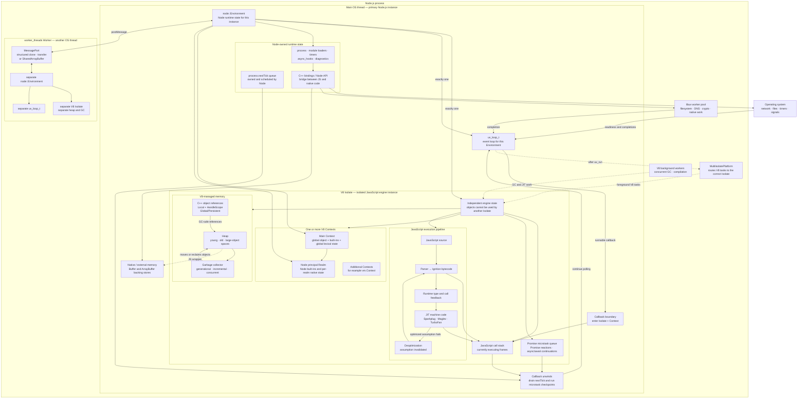

# V8 Core Concepts Essential to Node.js

> **Purpose:** Build a practical mental model of how V8, Node.js, and libuv
> cooperate, with special attention to `Isolate`, `Context`, `Realm`, memory,
> scheduling, native bindings, and Worker threads.
>
> **Source baseline:** Node.js Core checkout `725486d32a034feb95309390e3a903eb4e4332be`.
> This document is based on source inspection. It does not claim that the
> checkout was built or exercised at runtime.

The central relationship is:

> A `node::Environment` coordinates exactly one V8 `Isolate` and exactly one
> libuv event loop. V8 executes JavaScript; Node.js and libuv determine when
> JavaScript is called and connect it to operating-system capabilities.

## Concept map



## Essential distinctions

| Concept | What it is | What it is not |
| --- | --- | --- |
| `node::Environment` | A Node.js instance with per-instance runtime state, one `Isolate`, one `uv_loop_t`, one principal Realm, and one main Context. | The operating-system process or `process.env`. |
| V8 `Isolate` | An isolated V8 engine instance with separate engine state and ordinary JavaScript object graph. Only one thread may enter it at a time. | An event loop, an OS process, or a security sandbox. |
| V8 `Context` | A global execution environment inside an Isolate, including a global object and language intrinsics. | A new thread, heap, or complete Node.js instance. |
| Node `Realm` | Node's per-ECMAScript-realm native state associated with an eligible Context. The Environment's main Context has the principal Realm. | A synonym for every Context. In particular, an ordinary `vm.Context` does not automatically get a Node Realm. |
| JavaScript call stack | The active synchronous JavaScript frames on the thread currently inside the Isolate. | The V8 heap or the event-loop queue. |
| V8 heap | The V8-managed JavaScript object graph, divided into generations and specialized spaces. | Total process memory. Native allocations, thread stacks, and many backing stores can live outside it. |
| V8 handles | GC-aware references used by C++ code. `Local` handles live inside a `HandleScope`; `Global`/persistent handles can cross operations and require lifecycle management. | libuv handles such as `uv_tcp_t`, or OS file handles. |
| Promise microtask queue | V8-managed work such as Promise reactions and `async`/`await` continuations, run at explicit checkpoints established with the embedder. | `process.nextTick()` or a separate thread. |
| `process.nextTick()` queue | A Node-owned per-Environment queue drained around JavaScript callback boundaries. | The V8 microtask queue, despite often running near it. |
| libuv event loop | The per-Environment loop that waits for timers, I/O readiness/completion, and native request completion. | The JavaScript engine or the libuv worker pool. |
| libuv worker pool | Process-wide native worker threads used by selected filesystem, DNS, crypto, compression, and addon operations. | `worker_threads`; it does not execute arbitrary user JavaScript callbacks. |
| `worker_threads` Worker | A separate OS thread with its own Environment, Isolate, heap, module state, and event loop. | A second Context inside the main Isolate. |

## One asynchronous callback, end to end

1. JavaScript calls a Node API such as `fs.readFile()`.
2. Node's JavaScript implementation crosses a native binding boundary.
3. The native operation uses OS asynchronous I/O or the libuv worker pool.
4. Completion becomes runnable on the Environment's `uv_loop_t`.
5. Node enters the correct Isolate and Context and invokes the JavaScript
   callback.
6. The callback runs synchronously on that thread's JavaScript call stack.
7. When the callback boundary unwinds, Node coordinates `process.nextTick()`,
   Promise microtask checkpoints, Promise rejection processing, and async-hook
   bookkeeping.
8. Control returns to the event loop, which can wait for or dispatch more work.

The event loop therefore does not execute JavaScript in parallel with a
currently running callback on the same Isolate. A long synchronous callback
occupies that thread even if I/O completions are ready.

## Worker isolation and communication

Each `worker_threads` Worker is a separate JavaScript execution instance:

```text
OS thread
  └─ node::Environment
       ├─ V8 Isolate
       │    ├─ Context
       │    ├─ JavaScript heap
       │    └─ GC and engine state
       └─ uv_loop_t
```

Ordinary JavaScript objects cannot be directly referenced across Isolates.
Workers communicate through:

- structured cloning;
- transferable objects such as transferable `ArrayBuffer` instances;
- `MessagePort`;
- explicitly shared backing memory such as `SharedArrayBuffer`, normally
  coordinated with `Atomics`.

Sharing a `SharedArrayBuffer` does not merge the two V8 heaps. Each Worker still
has its own wrapper objects, execution state, and garbage collector.

## Source trail

- [`doc/api/embedding.md`](../doc/api/embedding.md): the documented
  `Environment` → one Isolate, one event loop, multiple Contexts relationship.
- [`src/env.h`](../src/env.h): `Environment` ownership and principal/synthetic
  Realm contract.
- [`src/node_realm.h`](../src/node_realm.h): Node's principal and synthetic
  Realm model.
- [`src/api/embed_helpers.cc`](../src/api/embed_helpers.cc):
  `SpinEventLoopInternal()`, including `uv_run()` and V8 platform task draining.
- [`src/api/callback.cc`](../src/api/callback.cc): callback-scope cleanup,
  microtask checkpoints, and the Node tick callback boundary.
- [`lib/internal/process/task_queues.js`](../lib/internal/process/task_queues.js):
  `process.nextTick()` and Promise microtask coordination.
- [`src/node_worker.cc`](../src/node_worker.cc): Worker Context, Environment,
  message port, and event-loop creation.
- [`deps/v8/include/v8-isolate.h`](../deps/v8/include/v8-isolate.h): the Isolate
  isolation and single-entering-thread contract.
- [`deps/v8/include/v8-local-handle.h`](../deps/v8/include/v8-local-handle.h):
  local, persistent, and scoped handle lifetime rules.
- [`doc/api/worker_threads.md`](../doc/api/worker_threads.md): structured clone,
  transfer, `MessagePort`, and shared-memory behavior.

